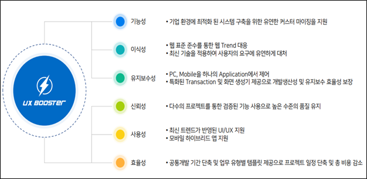

authors: glorial
summary: UXBooster 소개
id: nexacro-01-intro
categories: uxbooster-nexacro
tags: nexacro, uxbooster-nexacro
status: Published
feedback link: https://github.com/takeitcorp/takeitcorp.github.io/issues

# UXBooster 소개

## UXBooster
Duration: 0:02:00

UXBooster는 Spring Framework와 UI 플랫폼인 Nexacro를 보다 쉽게 통합하고 개발할 수 있도록 설계된 프레임워크입니다. 
이를 통해 개발자들은 복잡한 코딩 과정 없이 효율적으로 애플리케이션을 구축할 수 있으며, 
기업은 개발 속도를 높이고 비용을 절감할 수 있습니다.

**개발환경 구성**
* OS : Windows _(Nexacro Studio는 Windows계열에서만 사용 가능합니다)_
* JDK : OpenJDK 1.8
* Spring Framework : 4.3.28
* Nexacro SDK : 24.0.0.200
* Tomcat : 9.0
* DB : Oracle, MSSQL, MySQL, PostgreSQL, Tibero, Sybase, DB2
* IDE : Eclipse 2022-12(4.26.0), eGovFrameDev-4.2.0, Nexacro Studio(Latest)

[Download](https://codelabs-preview.appspot.com/?file_id=1E6XMcdTexh5O8JwGy42SY3Ehzi8gOfUGiqTiUX6N04o)

<button>[Download Zip](https://codelabs-preview.appspot.com/?file_id=1E6XMcdTexh5O8JwGy42SY3Ehzi8gOfUGiqTiUX6N04o)</button>
