authors: glorial
summary: 3. 화면 유형별 샘플 01
id: nexacro-03-smpForm01
categories: uxbooster-nexacro
tags: nexacro, uxbooster-nexacro
status: Published
feedback link: https://github.com/takeitcorp/takeitcorp.github.io/issues

# 3. 화면 유형별 샘플 01

## 개요
Duration: 0:03:00

> aside negative
>
>  **사용자 목록 조회**  
>  
>  **검색조건**에 맞는 **데이터** (샘플01)을 조회하여 Grid 출력  
>  데이터의 **코드** (부서코드, 사용자상태코드, 사용여부코드)를 **명칭**으로 가공

### **화면 유형**

크게 두 영역으로 분리됩니다
- **검색 영역** : 부서코드, 사용자ID, 사용여부
- **메인 영역** : 타이틀, Grid

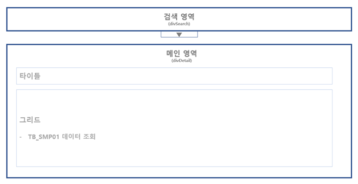

### **UXBooster 활용 기능**
 - **take.FormTemp** : 기초 코드 자동완성
 - **take.tranSelect** : 데이터 조회
 - **takeval.check** : 유효성 검증
 - **take.tranCode** : 공통코드 조회
 - **takegrid** : Grid 공통 기능
 - **take debug window** : 디버깅 화면

### **관련 데이터**
 - **공통코드** : `00009` 사용여부, `00017` 사용자상태
 - **테이블**
    - **TB_SMP01** : 샘플01
        |TB_SMP01|샘플01|||||
        ---|---|---|---|---|---
        USER_CD|사용자코드|Y|Y|VARCHAR2|10
        USER_ID|사용자ID|N|N|VARCHAR2|18
        USER_NM|사용자명|N|N|VARCHAR2|30
        USER_ENG_NM|사용자영문명|N|N|VARCHAR2|50
        USER_PW|비밀번호|N|N|VARCHAR2|18
        USER_IMG|사용자이미지|N|N|VARCHAR2|10
        USER_BIRTHDAY|사용자생년월일|N|N|VARCHAR2|8
        LUNAR_CD|양력음력구분|N|N|VARCHAR2|5
        USER_EMAIL|사용자이메일|N|N|VARCHAR2|100
        USER_MOBILE|사용자휴대폰번호|N|N|VARCHAR2|30
        USER_TEL|사용자전화번호|N|N|VARCHAR2|30
        USER_FAX|사용자FAX|N|N|VARCHAR2|30
        POST_CD|우편번호|N|N|VARCHAR2|10
        USER_ADDR1|사용자 주소1|N|N|VARCHAR2|150
        USER_ADDR2|사용자 주소2|N|N|VARCHAR2|50
        DEPT_CD|부서코드|N|N|VARCHAR2|10
        USER_POSITION|사용자직위|N|N|VARCHAR2|5
        USER_GRADE|사용자등급|N|N|VARCHAR2|5
        USER_STATUS|사용자상태|N|N|VARCHAR2|5
        DESC_TXT|상세설명|N|N|VARCHAR2|2000
        USE_YN|사용여부|N|N|VARCHAR2|1
        AGREE_YN|동의여부|N|N|VARCHAR2|1
        AGREE_DT|동의일시|N|N|DATE|-
        LOGIN_FAIL_CNT|로그인실패횟수|N|N|VARCHAR2|2
        LAST_LOGIN_DT|최종로그인일시|N|N|DATE|-
        PW_CHANGE_DT|비밀번호변경일시|N|N|DATE|-
        INIT_YN|초기화여부|N|N|VARCHAR2|1
        LOGIN_DEVICE|접속기기|N|N|VARCHAR2|50
        LOGIN_BROWSER|접속환경|N|N|VARCHAR2|50
        LOGIN_IP|접속IP|N|N|VARCHAR2|25
        JOIN_DATE|입사일|N|N|VARCHAR2|8
        MAIN_PROJECT|메인프로젝트|N|N|VARCHAR2|10
        VALID_YN|유효여부|N|N|VARCHAR2|1
        VALID_START_DATE|유효시작일자|N|N|VARCHAR2|8
        VALID_END_DATE|유효종료일자|N|N|VARCHAR2|8
        REG_DT|등록일시|Y|N|DATE|-
        REG_CD|등록자코드|N|N|VARCHAR2|10
        MOD_DT|수정일시|Y|N|DATE|-
        MOD_CD|수정자코드|N|N|VARCHAR2|10
   
    - **TB_SMP02** : 샘플02
        |TB_SMP02|샘플02|||||
        ---|---|---|---|---|---
        DEPT_CD|부서코드|Y|Y|VARCHAR2|5
        DEPT_NM|부서명|N|N|VARCHAR2|50
        DEPT_ENG_NM|부서영문명|N|N|VARCHAR2|50
        ML_CD|다국어코드|N|N|VARCHAR2|10
        PARENT_DEPT|상위부서|N|N|VARCHAR2|5
        DEPT_LEVEL|부서LEVEL|N|N|VARCHAR2|2
        DEPT_ORDER|부서정렬순서|N|N|VARCHAR2|50
        DESC_TXT|상세설명|N|N|VARCHAR2|500
        USE_YN|사용여부|N|N|VARCHAR2|1
        REG_DT|등록일시|Y|N|DATE|-
        REG_CD|등록자코드|N|N|VARCHAR2|10
        MOD_DT|수정일시|Y|N|DATE|-
        MOD_CD|수정자코드|N|N|VARCHAR2|10


### **개발결과물**
 - **Mapper** : src/main/resources/mappers/sample/Sample01Mapper.xml
 - **Nexacro** : nexacro/guide/form/smpForm01.xfdl

-------------------------------------------------------------------------------------------------------------

## Nexacro Form 생성
Duration: 0:03:00

### Folder 생성
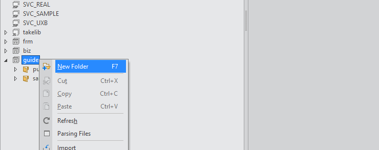

### Folder Name 입력

- **name** : `form`

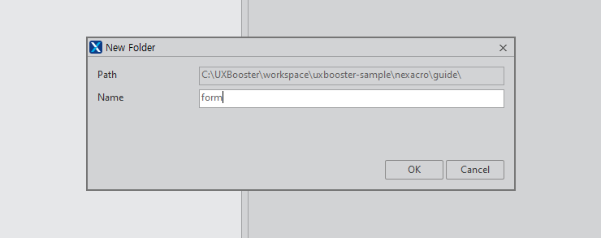

### Form 생성

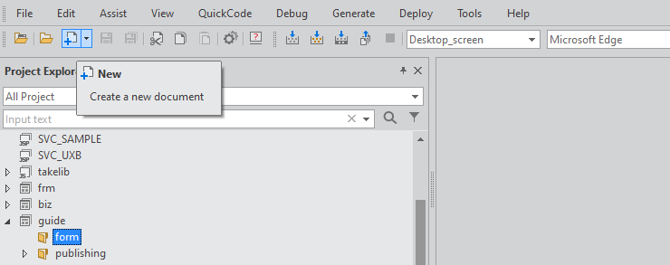

### Form Name 입력

- **Name** : `smpForm01`

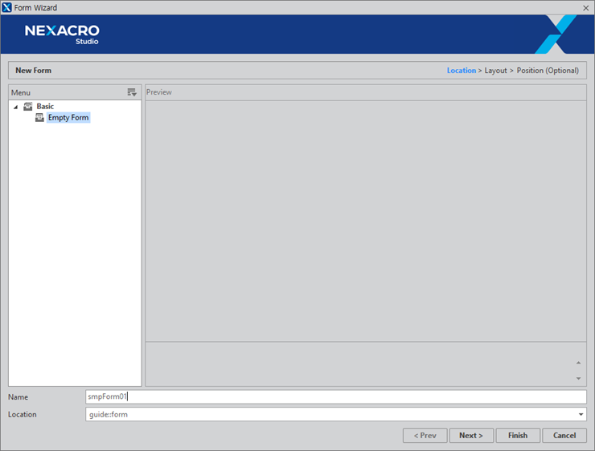

### Form Size 입력

- **Width** : `1659` px
- **Height** : `832` px

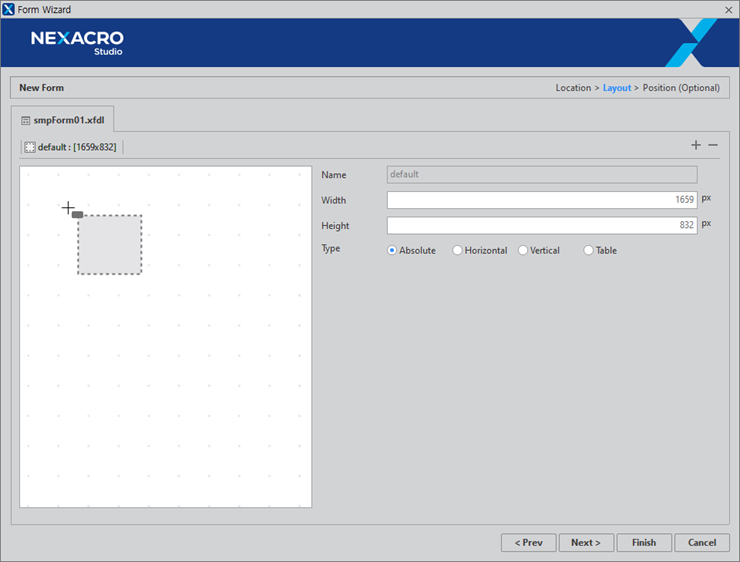

-------------------------------------------------------------------------------------------------------------

## 기초 코드 자동완성
Duration: 0:03:00

### **take.FormTemp**

[Code Snippet](../nexacro-02-install/index.html?index=..%2F..index#8) 기능을 활용해 기초 코드를 빠르게 완성할 수 있습니다.

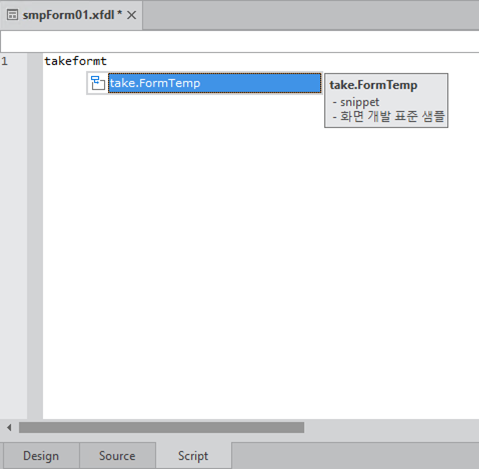

### **take.FormTemp 결과**

영역별로 구분된 기초 코드가 완성되었습니다.

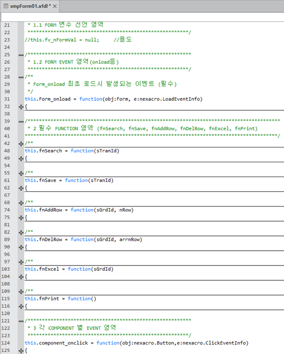

### **Form onload Event**

`Form_onload`함수를 `onload` Event에 할당합니다.

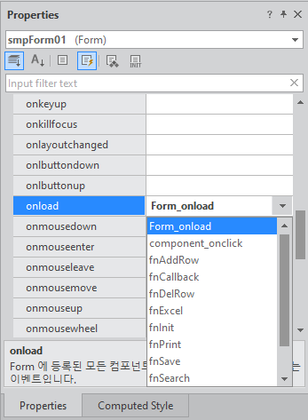

-------------------------------------------------------------------------------------------------------------

## 공통코드(00009) 조회
Duration: 0:15:00

### **Dataset 추가**

공통코드(00009)를 위한 `dsCboUseYn`을 추가합니다.

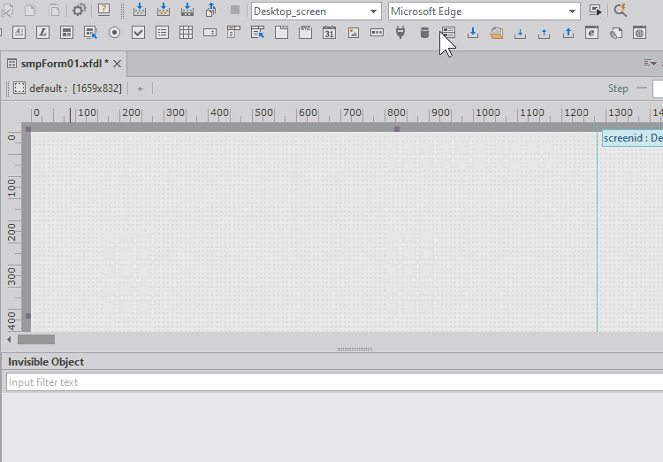

### **Dataset Column 추가**

- **code** : `코드ID`
- **name** : `코드명`
- **ref1** : `기타1`
- **ref2** : `기타2`
- **ref3** : `기타3`

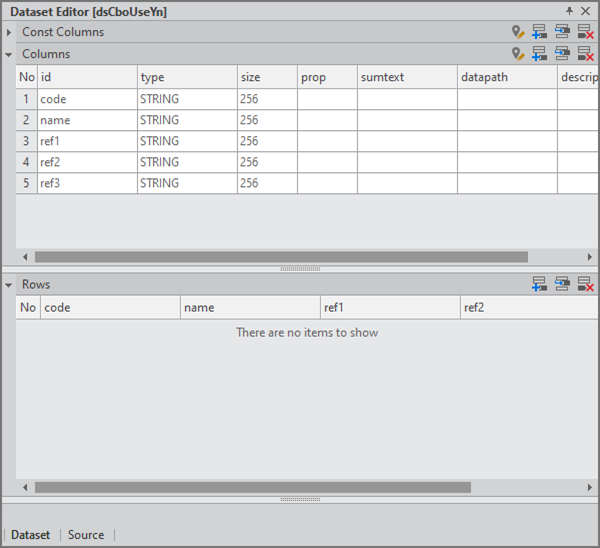

### **Form_onload 함수 수정**

`fnInit` 함수를 호출합니다.  

```javascript
/*********************************************************
 * 1.2 FORM EVENT 영역(onload등)
 ********************************************************/
/**
 * Form_onload 최초 로드시 발생되는 이벤트 (필수)
 */
this.Form_onload = function(obj:Form, e:nexacro.LoadEventInfo)
{
  if (take.formOnLoad(this))
  {    
    //초기화
    this.fnInit();
  }
};
```

### **fnInit 함수 수정**

`fnInit` 함수는 form이 `onload`되거나 MDI탭에 의해 `활성화` 될 경우 실행됩니다.

```javascript
/*********************************************************
 * 4 사용자 FUNCTION 영역
 ********************************************************/
/**
 * fnInit : 초기화 함수 검색조건 초기화 
 * @return {N/A}    N/A
 * @example this.fnInit();
 */
this.fnInit = function()
{
  //공통코드
  this.fnCommonCode();
};
```

### **fnCommonCode 함수 생성**

`take.tranCode` 함수를 사용하여 공통코드 조회기능을 구현합니다.

```javascript
/*********************************************************
 * 4 사용자 FUNCTION 영역
 ********************************************************/
/**
 * fnCommonCode : 코드호출 함수
 * @param  {String} N/A 
 * @example this.fnCommonCode();
 */
this.fnCommonCode = function ()
{
  take.tranCode(
    this,            // 현재 Form 객체
    ["00009"],       // 코드그룹ID : 시스템 - 코드관리
    ["dsCboUseYn"],  // InDataset (코드그룹ID 개수와 동일해야함)
    ["SEL"],         // 콤보헤더용 (ALL:전체, SEL:선택, "":사용안함)
                     // (코드그룹ID 개수와 동일해야함)
    // Call Back 함수 (함수명도 사용 가능 ex:"fnCallback")
    function(sId, nErrCd, sErrMsg)  
    {
      // sId     : Transaction Id
      // nErrCd  : Return Code (음수:오류)
      // sErrMsg : Return Message
    },
    true             // true:비동기, false:동기 (기본값은 비동기)
  );
};
```

### **QuickView 실행**

Eclipse의 `Tomcat`을 구동시키고 Nexacro Studio의 `QuickView`를 실행합니다.

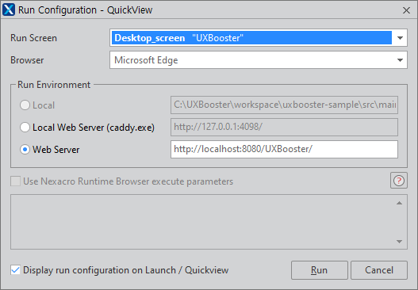  

### **디버깅 화면 조회**

브라우저 빈공간에 `ctrl + q`를 입력하면 디버깅 화면이 팝업됩니다.  
`Dataset` - `this.dsCboUseYn` - `View` 로 이동하여 Dataset을 확인할 수 있습니다.  

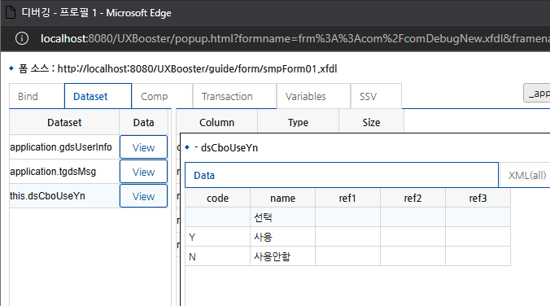

-------------------------------------------------------------------------------------------------------------

## 공통코드(00017) 조회
Duration: 0:10:00

### **Dataset 추가**

공통코드(00017)을 위한 `dsCboStatus`를 추가합니다.

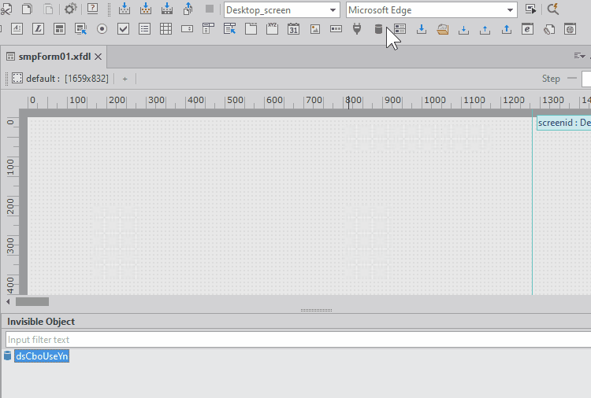

### **Dataset Column 추가**

- **code** : `코드ID`
- **name** : `코드명`
- **ref1** : `기타1`
- **ref2** : `기타2`
- **ref3** : `기타3`


### **fnCommonCode 함수 수정**

`코드그룹ID`, `InDataset`을 추가합니다.

```javascript
/*********************************************************
 * 4 사용자 FUNCTION 영역
 ********************************************************/
/**
 * fnCommonCode : 코드호출 함수
 * @param  {String} N/A 
 * @example this.fnCommonCode();
 */
this.fnCommonCode = function ()
{
  take.tranCode(
    this,                           // 현재 Form 객체
    ["00009", "00017"],             // 코드그룹ID : 시스템 - 코드관리
    ["dsCboUseYn", "dsCboStatus"],  // InDataset (코드그룹ID 개수와 동일해야함)
    ["SEL", ""],                    // 콤보헤더용 (ALL:전체, SEL:선택, "":사용안함)
                                    // (코드그룹ID 개수와 동일해야함)
    // Call Back 함수 (함수명도 사용 가능 ex:"fnCallback")
    function(sId, nErrCd, sErrMsg)  
    {
      // sId     : Transaction Id
      // nErrCd  : Return Code (음수:오류)
      // sErrMsg : Return Message
    },
    true             // true:비동기, false:동기 (기본값은 비동기)
  );
};
```

### **QuickView 실행**

Eclipse의 `Tomcat`을 구동시키고 Nexacro Studio의 `QuickView`를 실행합니다.


### **디버깅 화면 조회**

브라우저 빈공간에 `ctrl + q`를 입력하면 디버깅 화면이 팝업됩니다.  
`Dataset` - `this.dsCboStatus` - `View` 로 이동하여 Dataset을 확인할 수 있습니다.  

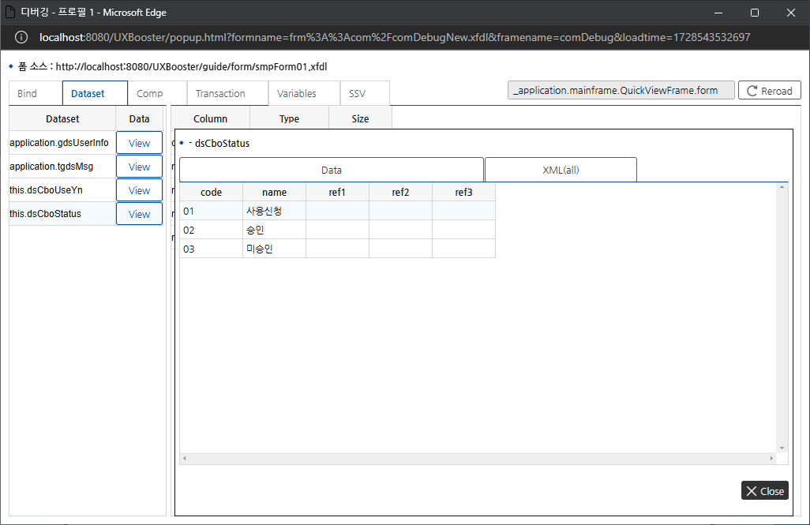

-------------------------------------------------------------------------------------------------------------

## 부서코드 조회
Duration: 0:05:00

### **Dataset 추가**

이전 단계처럼 Dataset을 추가합니다.

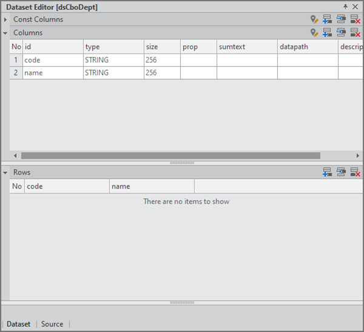

### **fnCommonCode 함수 수정**

공통코드 조회 `Callback` 에서 `take.tranSelect`를 사용한 부서 데이터 조회를 구현합니다.

```javascript
/*********************************************************
 * 4 사용자 FUNCTION 영역
 ********************************************************/
/**
 * fnCommonCode : 코드호출 함수
 * @param  {String} N/A 
 * @example this.fnCommonCode();
 */
this.fnCommonCode = function ()
{
  //부서 Dataset 데이터 비우기
  this.dsCboDept.clearData();

  take.tranCode(

    ... 중략 ....

    // Call Back 함수 (함수명도 사용 가능 ex:"fnCallback")
    function(sId, nErrCd, sErrMsg)  
    {
      //부서 데이터 조회
      take.tranSelect
      (
        this,                          // 현재 Form 객체
        "deptList",                    // Transaction Id
        "Sample01.smpFormDeptSelect",  // sqlMapperId
        "",                            // Indataset(서버로 보낼 dataset)
        "dsCboDept",                   // Outdataset(서버에서 받을 dataset)
        "",                            // Parameter
        "fnCallback"                   // Call Back 함수명 (함수를 바로 사용 가능)
      );
    }
  );
};
```

### **fnCallback 함수 수정**

**모든 Transaction**에 대한 Callback 작업을 `fnCallback`에 정의하는것이 **기본**입니다.  
`take.tranSelect`에서 지정한 `Transaction Id`로 구분할 수 있으며 조회 이후 동작을 구현할 수 있습니다.  

```javascript
/*********************************************************
 * 5 TRANSACTION OR CALLBACK 콜백 처리부분
 ********************************************************/
/**
 * fnCallback : transaction callback
 * @param  : sId      - 서비스 아이디 (공통 콜백에서 넘어옴)
 * @param  : nErrCd   - 에러코드 (공통 콜백에서 넘어옴)
 * @param  : sErrMsg  - 에러메세지 (공통 콜백에서 넘어옴)
 * @return : N/A
 * @example :  
 */
this.fnCallback = function(sId, nErrCd, sErrMsg)
{
  //Transaction 에러는 공통에서 처리
  switch(sId)
  {
    // 부서 검색조건 조회 콜백
    case "deptList" :
      break;
      
    default :
      break;
  }    
};
```

-------------------------------------------------------------------------------------------------------------

## 검색 영역
Duration: 0:05:00

> aside positive
> **Design Guide**  
> 
> - Layout : 검색조건 개수에 따라 Layout을 결정합니다.
> 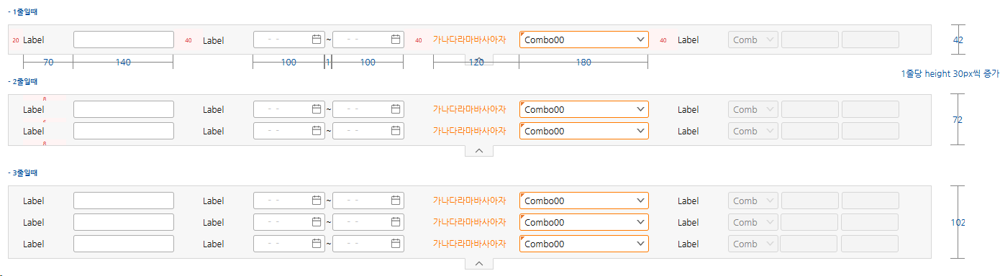
> 
> - Label : 글자수에 따라 `width`를 조절합니다.  
> 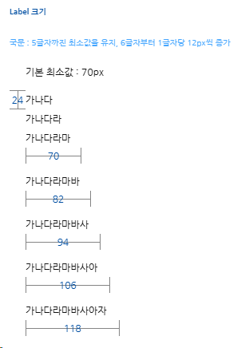
> 
> - 위치 : nexacro/_guide/publishing/03. PatternGuide.xfdl_

### **검색조건 Layout**
  * **1행 3열 Layout을 사용합니다.**

### **검색조건 대상**

- `TB_SMP01`을 조회 시 사용할 검색조건입니다.
  **Desc** | **TB_SMP01** | **Component Id** | **Dataset Column** | **Inner Dataset**
  ---------|----------|---------|---------|---------
  `부서코드` | DEPT_CD | cboDeptCd | deptCd | dsCboDept 
  `사용자ID` | USER_ID | edtUserId | userId | - 
  `사용여부` | USE_YN | cboUseYn | useYn | dsCboUseYn


### **검색 영역용 Div 추가**
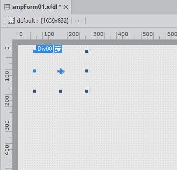

### **Div Properties 수정**
- **cssclass** : `div_WF_search_d1`
- **id** : `divSearch` _id를 임의로 변경 하지 말 것_
- **left** : `0`
- **top** : `0`
- **height** : `42`
- **right** : `0`
- **minwidth** : `1300`

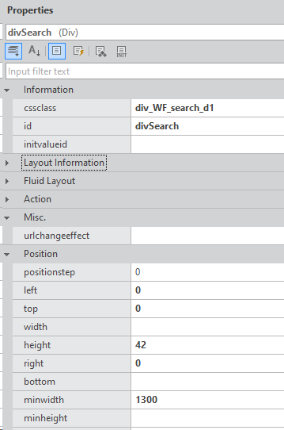

-------------------------------------------------------------------------------------------------------------

## 검색 영역 - 부서코드
Duration: 0:10:00

### **Static 추가**

`divSearch` 내부에 `Static`을 추가합니다.

  - **id** : `staDeptT` _id를 임의로 변경 하지 말 것_
  - **text** : `사용자 부서`
  - **left** : `20`
  - **top** : `8`
  - **width** : `70`
  - **height** : `24`

  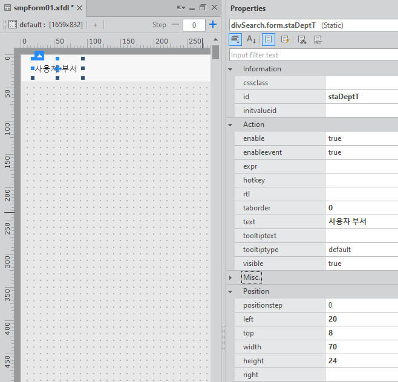  

### **Combo 추가**  

`divSearch` 내부에 `Combo`를 추가합니다.

  - **id** : `cboDept` _id를 임의로 변경 하지 말 것_
  - **left** : `90` _staDeptT와의 공백 : 0px_
  - **top** : `8`
  - **width** : `180`
  - **height** : `24`

  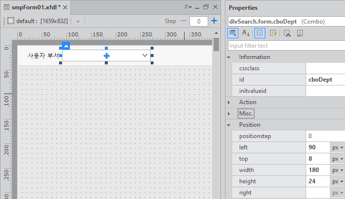

### **InnerDataset 추가**  
  - **innerdataset** : `dsCboDept`
  - **code** : `code`
  - **name** : `name`
   
  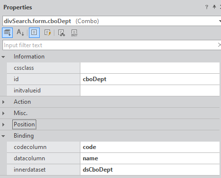  
   
### **기본값 지정**  
  기본값 지정을 위해 `fnCallback`을 수정합니다.  
  `dsCboDept`의 데이터가 존재할 경우 `cboDept`의 `index`를 `0`으로 지정합니다.  

  ```javascript
  /*********************************************************
   * 5 TRANSACTION OR CALLBACK 콜백 처리부분
   ********************************************************/
  /**
   * fnCallback : transaction callback
   * @param  : sId      - 서비스 아이디 (공통 콜백에서 넘어옴)
   * @param  : nErrCd   - 에러코드 (공통 콜백에서 넘어옴)
   * @param  : sErrMsg  - 에러메세지 (공통 콜백에서 넘어옴)
   * @return : N/A
   * @example :  
   */
  this.fnCallback = function(sId, nErrCd, sErrMsg)
  {
    //Transaction 에러는 공통에서 처리
    switch(sId)
    {
      // 부서 검색조건 조회 콜백
      case "deptList" :
        //변수 선언
        var objDs;

        //부서 검색조건 Dataset
        objDs = this.dsCboDept;

        //부서 검색조건 데이터가 있으면
        if (objDs.rowcount > 0)
        {
          //부서 검색조건 콤보 첫번데 데이터 셋팅
          this.divSearch.form.cboDept.set_index(0);
        }
        break;
        
      default :
        break;
    }    
  };
  ```

-------------------------------------------------------------------------------------------------------------

## 검색 영역 - 사용자ID
Duration: 0:06:00

### **Static 추가**

`divSearch` 내부에 `Static`을 추가합니다.

  - **id** : `staUserIdT` _id를 임의로 변경 하지 말 것_
  - **text** : `ID`
  - **left** : `310`
  - **top** : `8`
  - **width** : `70`
  - **height** : `24`

  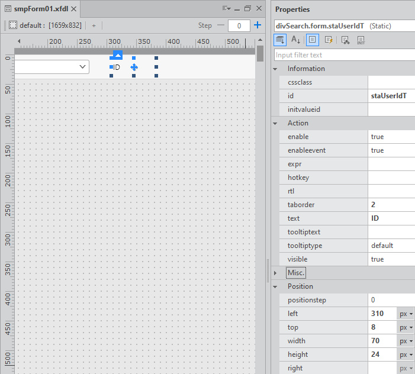

### **Edit 추가**  

`divSearch` 내부에 `Edit`를 추가합니다.

  - **id** : `edtUserId` _id를 임의로 변경 하지 말 것_
  - **left** : `380` _staUserIdT와의 공백 : 0px_
  - **top** : `8`
  - **width** : `140`
  - **height** : `24`

  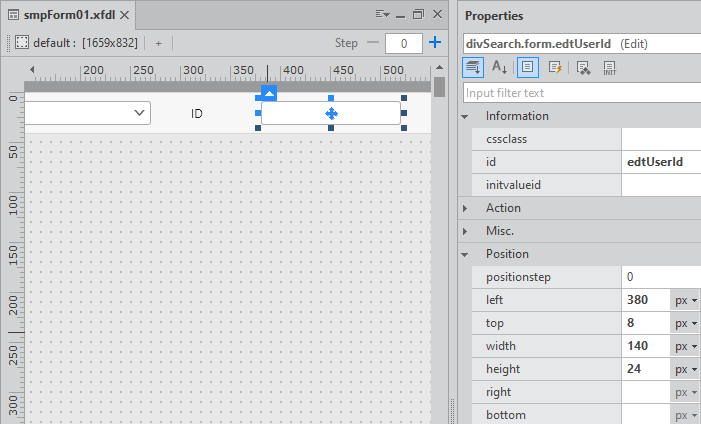

-------------------------------------------------------------------------------------------------------------

## 검색 영역 - 사용여부
Duration: 0:06:00

### **Static 추가**

`divSearch` 내부에 `Static`을 추가합니다.

  - **id** : `staUseYnT` _id를 임의로 변경 하지 말 것_
  - **text** : `사용여부`
  - **left** : `560`
  - **top** : `8`
  - **width** : `70`
  - **height** : `24`

  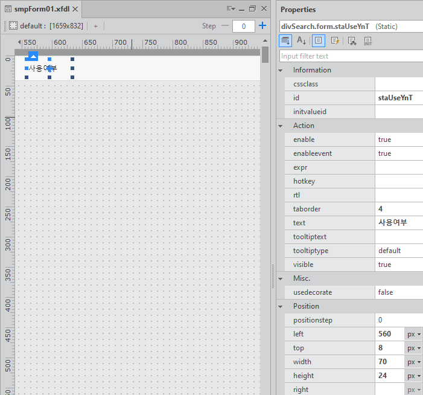

### **Combo 추가**

`divSearch` 내부에 `Combo`를 추가합니다.

  - **id** : `cboUseYn` _id를 임의로 변경 하지 말 것_
  - **left** : `630` _staUseYnT와의 공백 : 0px_
  - **top** : `8`
  - **width** : `140`
  - **height** : `24`

  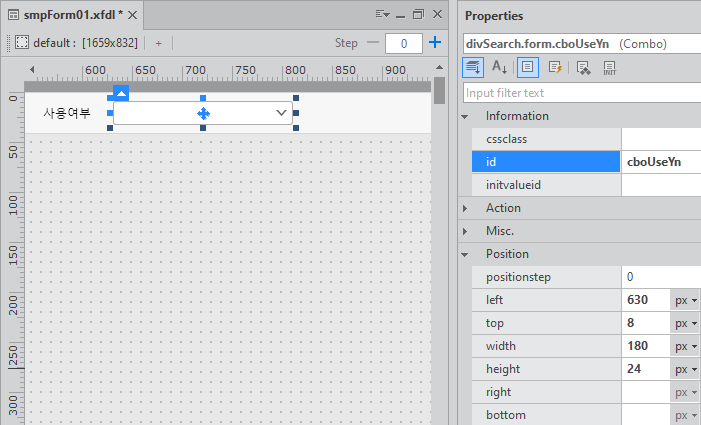

### **InnerDataset 추가**  
  - **innerdataset** : `dsCboUseYn`
  - **code** : `code`
  - **name** : `name`

  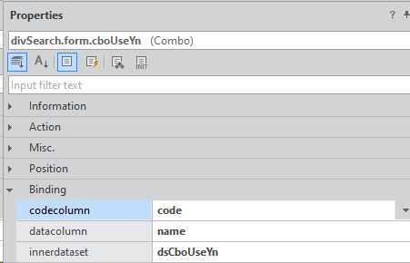

### **기본값 지정**
  기본값 지정을 위해 fnCommonCode를 수정합니다.  
  `dsCboUseYn`의 데이터가 존재할 경우 `cboUseYn`의 `index`를 `0`으로 지정합니다.  

  ```javascript
  /*********************************************************
   * 4 사용자 FUNCTION 영역
   ********************************************************/
  /**
   * fnCommonCode : 코드호출 함수
   * @param  {String} N/A 
   * @example this.fnCommonCode();
   */
  this.fnCommonCode = function ()
  {
    ... 중략 ....

    take.tranCode(

      ... 중략 ....

      //사용여부 공통코드 데이터가 있는지 여부
      if (this.dsCboUseYn.rowcount > 0)
      {
        //사용여부 검색조건 콤보에 첫번째 값 세팅
        this.divSearch.form.cboUseYn.set_index(0);
      }
    );
  };
  ```

-------------------------------------------------------------------------------------------------------------

## 검색 영역 - Binding
Duration: 0:05:00

> aside positive
>
>  사용자가 선택 또는 입력한 검색조건의 `value`를 유지하기 위해선 Dataset에 Binding하는 과정이 필요합니다.

### **Dataset 추가**

`dsSearch`를 만들고 아래 컬럼들과 **1행**을 추가해 줍니다.
* userId
* useYn
* deptCd

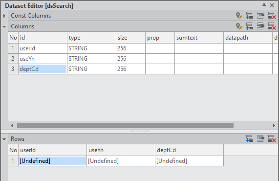

### **부서코드 Binding**
부서코드 `cboDeptCd`의 `value`를 Binding 합니다.
* **Dataset** : `dsSearch`
* **Column** : `deptCd`

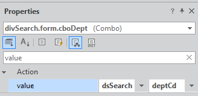

### **사용자ID Binding**
사용자ID `edtUserId`의 `value`를 Binding 합니다.
* **Dataset** : `dsSearch`
* **Column** : `userId`

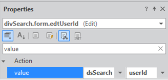

### **사용여부 Binding**
사용여부 `cboUseYn`의 `value`를 Binding 합니다.
* **Dataset** : `dsSearch`
* **Column** : `useYn`

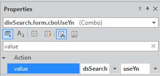

-------------------------------------------------------------------------------------------------------------

## 검색 영역 - Event
Duration: 0:06:00

> aside positive
>
> 검색 조건이 변경 될 경우 데이터 조회를 실행합니다.

### 부서코드 onitemchanged

부서코드 `Combo`를 변경할 때 `fnSearch` 함수를 호출 합니다.

```
/*********************************************************
 * 3 각 COMPONENT 별 EVENT 영역
 ********************************************************/
this.divSearch_cboDept_onitemchanged = function(obj:nexacro.Combo,e:nexacro.ItemChangeEventInfo)
{
  //사용자 목록 조회
  this.fnSearch("userList");
};
```

### 사용여부 onitemchanged

사용여부 `Combo`를 변경할 때 `fnSearch` 함수를 호출 합니다.

```
/*********************************************************
 * 3 각 COMPONENT 별 EVENT 영역
 ********************************************************/
this.divSearch_cboUseYn_onitemchanged = function(obj:nexacro.Combo,e:nexacro.ItemChangeEventInfo)
{
  //사용자 목록 조회
  this.fnSearch("userList");
};
```

### 사용자ID onkeydown

사용자ID `Edit`에서 `Enter`키 입력될 때 `fnSearch` 함수를 호출합니다.

```
/*********************************************************
 * 3 각 COMPONENT 별 EVENT 영역
 ********************************************************/
this.divSearch_edtUserId_onkeydown = function(obj:nexacro.Edit,e:nexacro.KeyEventInfo)
{
  //엔터키 다운
  if (e.keycode == nexacro.Event.KEY_ENTER)
  {
    //사용자 목록 조회
    this.fnSearch("userList");
  }
};
```

> aside negative
>
> **주요 Key Code**  
> 
> nexacro.Event.KEY_META = 91;  
> nexacro.Event.KEY_RETURN = 13;  
> nexacro.Event.KEY_ENTER = 13;  
> nexacro.Event.KEY_TAB = 9;  
> nexacro.Event.KEY_UP = 38;  
> nexacro.Event.KEY_DOWN = 40;  
> nexacro.Event.KEY_LEFT = 37;  
> nexacro.Event.KEY_RIGHT = 39;  
> nexacro.Event.KEY_SPACE = 32;  
> nexacro.Event.KEY_SHIFT = 16;  
> nexacro.Event.KEY_CTRL = 17;  
> nexacro.Event.KEY_CONTROL = 17;  
> nexacro.Event.KEY_ALT = 18;  
> nexacro.Event.KEY_ESC = 27;  

-------------------------------------------------------------------------------------------------------------

## Mybatis Mapper
Duration: 0:10:00

### **Mapper 생성**

`Eclipse`에서 `src/main/resources/mappers/sample/Sample01Mapper.xml` 를 생성합니다.

### **Mapper 구조**

```xml
<?xml version="1.0" encoding="UTF-8"?>
<!DOCTYPE mapper PUBLIC "-//mybatis.org//DTD Mapper 3.0//EN" "http://mybatis.org/dtd/mybatis-3-mapper.dtd">

<mapper namespace="Sample01">
  <!-- 쿼리 영역 -->
</mapper>
```

### **부서코드 조회 쿼리**

`smpFormDeptSelect` 를 쿼리 영역에 작성합니다.

```xml
<select id="smpFormDeptSelect" parameterType="map" timeout="0" resultType="takeResultMap" useCache="false">
  <![CDATA[
  /*
   * Sample01.smpFormDeptSelect
   * 부서 목록 조회
   * @author takeit
   * @since 2023.04.24
   */
  ]]>
  SELECT CODE, NAME
    FROM (
          SELECT '' AS CODE
               , '전체' AS NAME
               , 0 AS CODE_ORDER
          <include refid="UxbInc.dual"/>
           UNION ALL
          SELECT DEPT_CD AS CODE
               , DEPT_NM AS NAME
               , 1 AS CODE_ORDER
            FROM TB_SMP02
           WHERE PARENT_DEPT = '0')
   ORDER BY CODE_ORDER, CODE
</select>
```

### **사용자 목록 조회 쿼리**

`smpFormSelect` 를 쿼리 선언부에 작성합니다.

```xml
<select id="smpFormSelect" parameterType="map" timeout="0" resultType="takeResultMap" useCache="false">
  <![CDATA[
  /*
   * Sample01.smpFormSelect
   * 샘플 목록 조회
   * @author takeit
   * @since 2023.04.24
   */
  ]]>
  SELECT USER_CD
       , USER_ID
       , USER_NM
       , USER_BIRTHDAY
       , USER_EMAIL
       , USER_MOBILE
       , USER_TEL
       , USER_FAX
       , DEPT_CD
       , USER_STATUS
       , USE_YN
       , AGREE_YN
       , JOIN_DATE
    FROM TB_SMP01
   WHERE (CASE WHEN USE_YN IS NULL THEN 'N' ELSE USE_YN END) = #{useYn}
   <if test="@kr.co.takeit.util.MybatisUtil@notEmpty( deptCd ) ">
     AND DEPT_CD = #{deptCd}
   </if>
   <if test="@kr.co.takeit.util.MybatisUtil@notEmpty( userId ) ">
     AND USER_ID LIKE <include refid="UxbInc.like"><property name="arg1" value="#{userId}"/></include>
   </if>
   ORDER BY USER_CD
</select>
```

> aside negative
>
>  **takeResultMap**  
>  * **UXBooster**의 resultMap은 SQL 실행 결과를 `Camel`, `Snake`등으로 쉽게 변환 할 수 있습니다.

> aside negative
>
>  **MybatisUtil**  
>  * **UXBooster**는 공백체크를 위한 Mybatis조건문을 `MybatisUtil`의 메소드 형태로 제공합니다.  
>     
>    * `MybatisUtil.empty` : Value 공백 또는 Null 체크  
>    * `MybatisUtil.notEmpty` : Value 존재 체크  

> aside negative
>
>  **UxbInc**  
>  * **UXBooster**의 Mapper는 (DBMS별 차이점에 따른) SQL의 추가 수정없이 Vendor별로 정의된 `UXBInc`의 쿼리를 자동으로 실행합니다.  
>  * **UXBooster** 내부 Table들의 명칭을 변수로 관리 함으로써 Table명칭 변경, 접두사/접미어 추가, 네임스페이스 지정에 
유연하게 대처 할 수 있습니다.

### **Tomcat 재시작**

Eclipse의 `Tomcat`을 재시작 합니다.

-------------------------------------------------------------------------------------------------------------

## fnSearch
Duration: 0:15:00

> aside positive
>
>  **fnSearch**는 UXBooster에서 `조회` 시 사용하는 기본함수입니다.  
>  반드시 존재해야 하는 함수입니다.

### **fnSearch 함수**

`take.tranSelect`를 사용한 `TB_SMP01` 데이터 조회를 구현합니다.

```javascript
/*********************************************************
 * 2 필수 FUNCTION 영역
 ********************************************************/
/**
 * fnSearch : 조회 transaction (필수) --> 공통 조회에서 호출할 디폴트값 세팅 필요
 * @param  {String} sTranId 트랜젝션 아이디
 * @return {N/A}    N/A
 * @example this.fnSearch("ID");
 */
this.fnSearch = function(sTranId)
{
  //공통 조회에서 호출할 디폴트값 세팅 필요
  if (take.nvl(sTranId, "")=="") sTranId = "userList";
  
  switch(sTranId) {   
    case "userList":
      //Dataset 비우기
      this.dsList.clearData();

      //조회
      take.tranSelect(
        this,                      //현재 Form 객체
        sTranId,                   //Transaction Id
        "Sample01.smpFormSelect",  //SQL Mapper Id
        "dsSearch",                //InDataset(서버로 보낼 dataset)
        "dsList",                  //OutDataset(서버에서 받을 dataset)
        "",                        //Parameter
        "fnCallback");             //Callback 함수명(함수를 바로 사용 가능)

      break;

    default:
      break;
    }
  };
```

### **fnCallback 함수 수정**

`switch~case`구문에 `Transaction Id`가 `userList`인 경우를 추가해줍니다.

```javascript
/*********************************************************
 * 5 TRANSACTION OR CALLBACK 콜백 처리부분
 ********************************************************/
/**
 * fnCallback : transaction callback
 * @param  : sId      - 서비스 아이디 (공통 콜백에서 넘어옴)
 * @param  : nErrCd   - 에러코드 (공통 콜백에서 넘어옴)
 * @param  : sErrMsg  - 에러메세지 (공통 콜백에서 넘어옴)
 * @return : N/A
 * @example :  
 */
this.fnCallback = function(sId, nErrCd, sErrMsg)
{
  //Transaction 에러는 공통에서 처리
  switch(sId)
  {
    // 부서 검색조건 조회 콜백
    case "deptList" :
      ...중략...
      break;
    
    //조회 콜백
    case "userList" :
      break;

    default :
      break;
  }    
};
```

### **Dataset 추가**

1. Dataset을 추가합니다.  

`TB_SMP01` 데이터를 위한 `dsList`를 추가합니다.

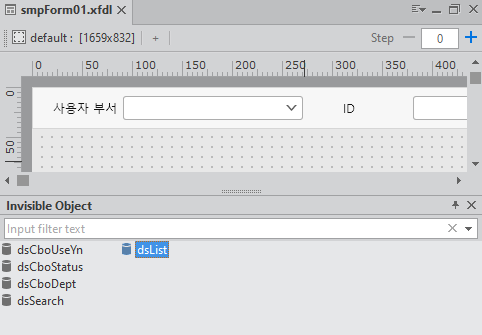  

2. QuickView를 실행합니다.  
  

3. 검색조건을 변경하여 데이터를 조회합니다.  
`사용여부`를 `사용`으로 선택합니다.  
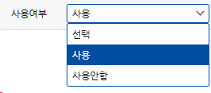  

4. 디버깅 화면을 조회합니다.  
`ctrl + q`를 입력하여 디버깅 화면을 조회합니다.  
`Dataset` - `this.dsList` - `view` 로 이동하여 Dataset을 확인할 수 있습니다.  
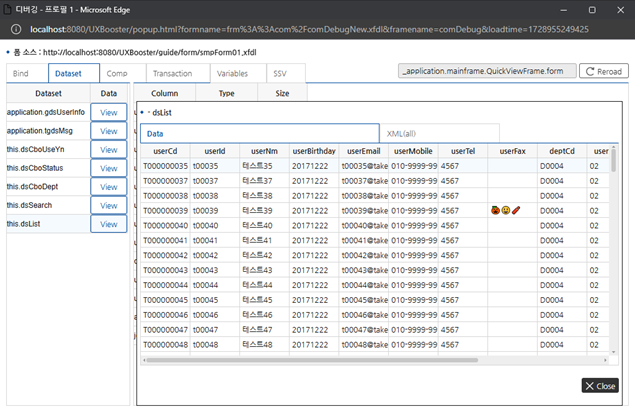

5. Dataset 컬럼정보를 복사합니다.  
`XML(all)`로 이동하여 Dataset의 `ColumnInfo`를 복사합니다.  
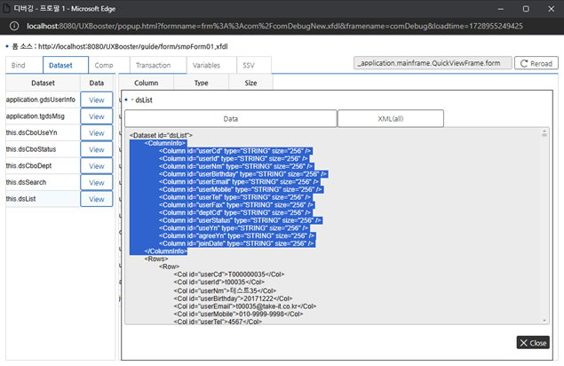

6. Dataset source를 조회합니다.  
`Nexacro Studio`로 돌아와 `dsList`의 `source`로 이동합니다.  
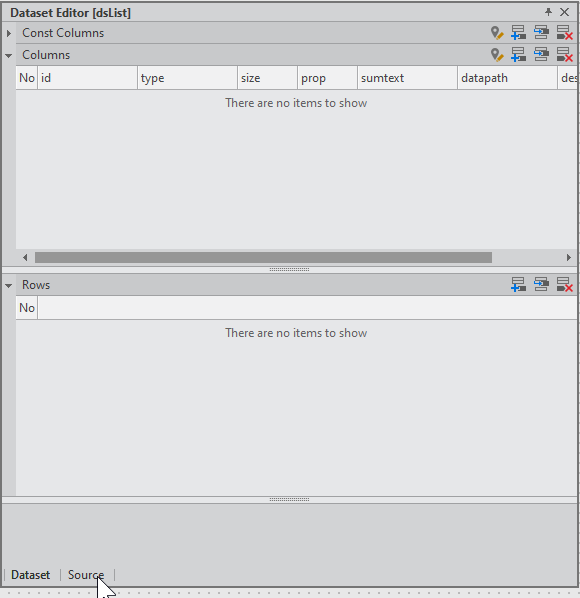

7. Dataset 컬럼을 추가합니다.  
`ColumnInfo`를 붙여넣어 Dataset 컬럼 정보를 간편하게 등록할 수 있습니다.  
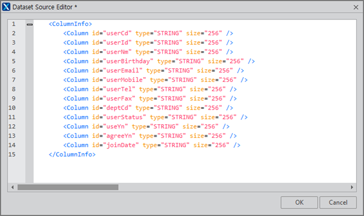

-------------------------------------------------------------------------------------------------------------

## 유효성 검증
Duration: 0:03:00

> aside positive
>
>  검색조건 중 `사용여부`를 필수 조건으로 지정합니다.  
>  검증이 실패한다면 안내 메세지 출력과 동시에 스크립트 실행을 중단합니다.  

### **fnInit 함수 수정**

`takeval.add` 함수를 사용하여 `사용여부`를 유효성 검증 대상으로 추가합니다.

```javascript
/*********************************************************
 * 4 사용자 FUNCTION 영역
 ********************************************************/
/**
 * fnInit : 초기화 함수 검색조건 초기화 
 * @return {N/A}    N/A
 * @example this.fnInit();
 */
this.fnInit = function()
{
  //공통코드
  this.fnCommonCode();

  //변수 선언
  var objDivForm;
  objDivForm = this.divSearch.form;
  
  //필수 검색조건 추가
  takeval.add(
    this, 
    "Search",                  //유효성 검증 그룹 아이디(그룹별로 추가할 수 있음)
    objDivForm.cboUseYn,       //체크 대상 컴포넌트
    objDivForm.staUseYnT.text, //체크할 명칭(ex:"사용여부")
    "value",                   //체크대상 (컴포넌트:Properti, Grid:Cell, Dataset:Column 명)
    true,                      //null check
    "string",                  //타입(string, number, date등)체크
    "",                        //체크수(문자는 자릿수, 숫자는 구간[form,to])
    "");                       //Byte로 체크여부 (생략가능) 
};
```

### **fnSearch 함수 수정**

`takeval.check` 함수를 호출하여 유효성을 검증합니다.

```javascript
/*********************************************************
 * 2 필수 FUNCTION 영역
 ********************************************************/
/**
 * fnSearch : 조회 transaction (필수) --> 공통 조회에서 호출할 디폴트값 세팅 필요
 * @param  {String} sTranId 트랜젝션 아이디
 * @return {N/A}    N/A
 * @example this.fnSearch("ID");
 */
this.fnSearch = function(sTranId)
{
  //공통 조회에서 호출할 디폴트값 세팅 필요
  if (take.nvl(sTranId, "")=="") sTranId = "userList";
  
  switch(sTranId) {   
    case "userList":

      //유효성 검증
      if(!takeval.check(this, "Search")) return;

      //Dataset 비우기
      this.dsList.clearData();

      ...중략...
  }
};
```

### **출력 예시**

`사용여부`를 선택하지 않았을 때 유효성 검증을 실패합니다.  
그리고 사용자에게 안내 메시지가 출력되며 실패한 `Component`로 `Focus`가 이동합니다.

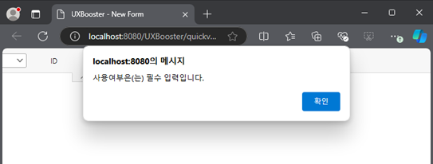

-------------------------------------------------------------------------------------------------------------

## 메인 영역
Duration: 0:02:00

### **메인 영역용 Div 추가**
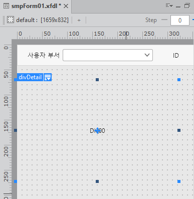

### **Div Properties 수정**
  - **id** : `divDetail` _id를 임의로 변경 하지 말 것_
  - **left** : `0`
  - **top** : `73`
  - **right** : `0`
  - **bottom** : `0`
  - **minwidth** : `1300`

  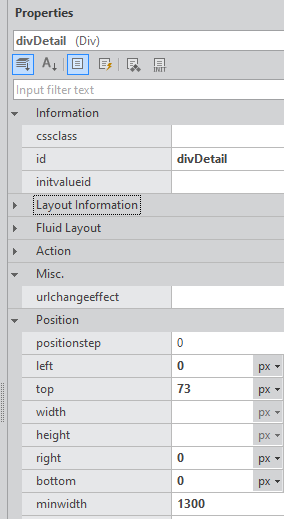

-------------------------------------------------------------------------------------------------------------

## 메인 영역 - 타이틀
Duration: 0:02:00

### **타이틀 Label 추가**

`divDetail` 내부에 `Static`을 추가합니다.

  - **cssclass** : `sta_WF_title02`
  - **id** : `staDetailTitle` _id를 임의로 변경 하지 말 것_
  - **text** : `사용자 목록`
  - **usedecorate** : `true`
  - **left** : `0`
  - **top** : `0`
  - **height** : `21`
  - **right** : `0`

  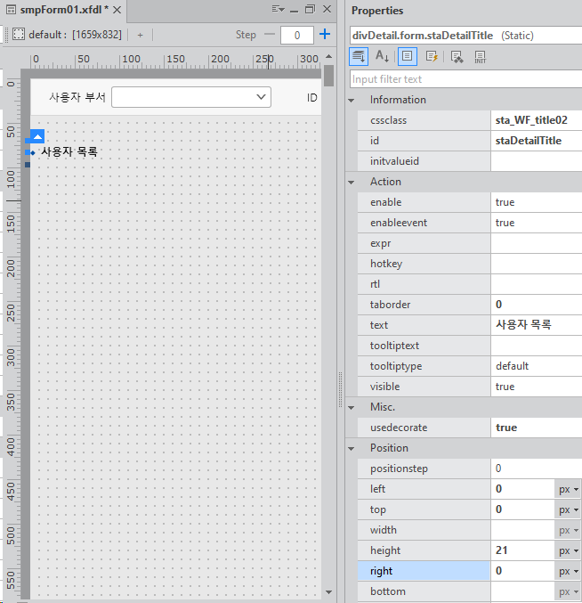

-------------------------------------------------------------------------------------------------------------

## 메인 영역 - Grid
Duration: 0:03:00

### **Grid 추가**

`divDetail` 내부에 `Grid`를 추가합니다.

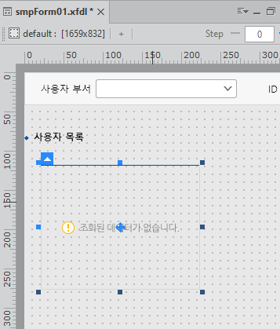

### **Grid Properties 수정**
  - **id** : `grdDetail` _id를 임의로 변경 하지 말 것_
  - **autofittype** : `col`
  - **left** : `0`
  - **top** : `6` ~ `staDetailTitle`
  - **right** : `0`
  - **bottom** : `0`

  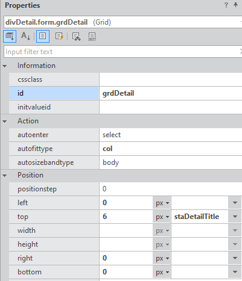

### **Dataset Binding**

  `binddataset`속성을 `dsList`로 지정합니다.

  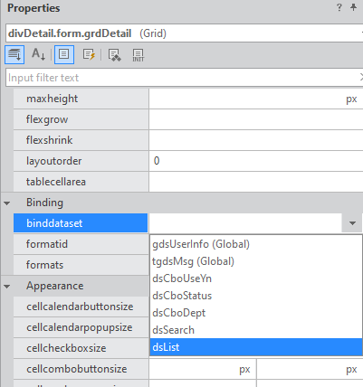

  `binddataset`속성을 지정하게 되면 아래와 같이 Dataset의 컬럼들이 Grid에 추가됩니다.

  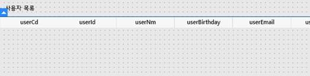

### **조회 결과**

`dsList`의 데이터가 Grid에 출력되는 것을 확인할 수 있습니다.  
아직 Grid 헤더와 너비, 높이, 정렬을 수정해야합니다.  
또한 코드로 표현되고있는 셀Text를 명칭으로 변환해야합니다.

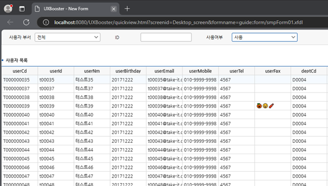

-------------------------------------------------------------------------------------------------------------

## 메인 영역 - Grid 컬럼
Duration: 0:05:00

### **Grid Row Size**

Head Row의 `size`를 `32`로 변경합니다.  

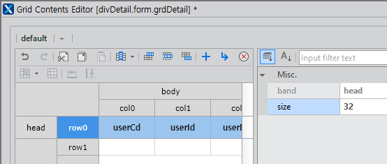

Body Row의 `size`를 `30`으로 변경합니다.  

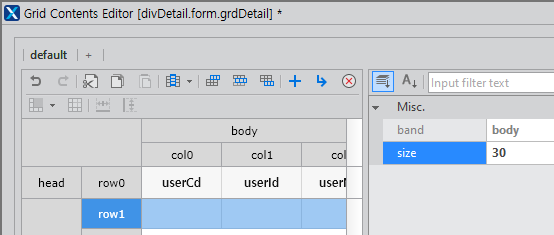

### **Head Col**

* `userCd` 컬럼을 삭제합니다.
* 다른 컬럼들은 `text`와 `size`를 지정합니다.

  **Col**       | **text**     | **Size**
  --------------|--------------|------
  userId        | ID           | 80  
  userNm        | 성명         | 110 
  userBirthday  | 생년월일     | 120 
  userEmail     | 이메일       | 160 
  userMobile    | 모바일       | 110 
  userTel       | 유선전화     | 110 
  userFax       | 팩스         | 110 
  deptCd        | 부서명       | 100 
  userStatus    | 상태         | 100 
  useYn         | 사용여부     | 100 
  agreeYn       | 동의여부     | 80  
  joinDate      | 가입일자    | 120 


-------------------------------------------------------------------------------------------------------------

## 메인 영역 - Grid 셀
Duration: 0:06:00

### **부서코드 명칭 적용**
  - **displaytype** : `combotext`
  - **combodataset** : `dsCboDept`
    - **combocodecol** : `code`
    - **combodatacol** : `name`

  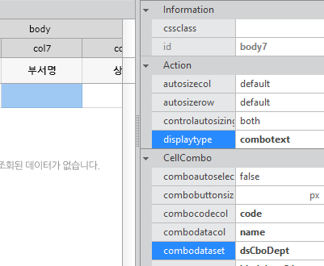


### **사용자상태 명칭 적용**
  - **displaytype** : `combotext`
  - **combodataset** : `dsCboStatus`
    - **combocodecol** : `code`
    - **combodatacol** : `name`

  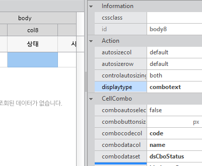

### **사용여부 명칭 적용**
  - **displaytype** : `combotext`
  - **combodataset** : `dsCboUseYn`
    - **combocodecol** : `code`
    - **combodatacol** : `name`

  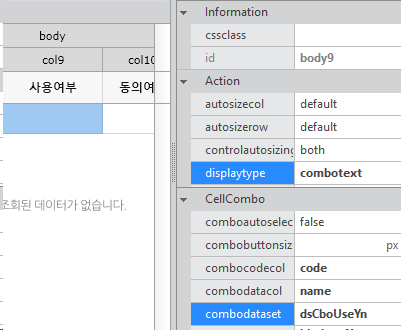

### **가입일자 Format**
  - **displaytype** : `date`
  - **textAlign** : `center`
  - **caldardateformat** : `yyyy-MM-dd`

  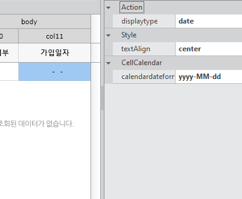

### **조회 결과**

코드로 표현되고있던 셀Text가 `명칭`으로 변환되었습니다.  
더불어 `가입일자`도 날짜 형태로 변환되었습니다.  

**Dateset을 그대로 유지한채 Grid의 셀 출력형태만 변경된 것 입니다.**

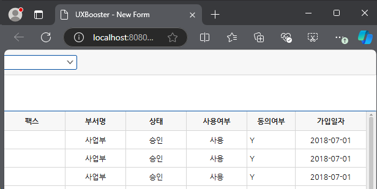

-------------------------------------------------------------------------------------------------------------

## 메인영역 - takegrid
Duration: 0:01:00

### **takegrid 적용**

Grid `userproperty` 를 추가합니다.

 - **Name** : `takegrid`
 - **Value** : `select`

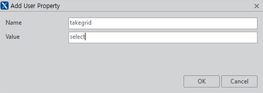

### **적용 결과**

타이틀 우측으로 전체건수가 표현됩니다.  
Grid에 `순번` 컬럼이 추가됩니다.  
나머지 기능은 Grid를 `우클릭`하여 사용할 수 있습니다.  

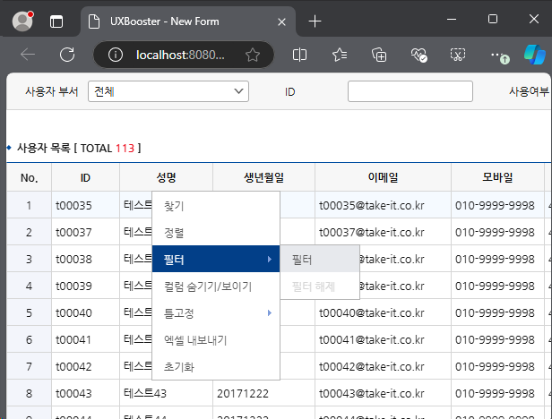


> aside negative
>
> **그룹 Option**
> * `all` : 모든기능  
> * `select` : no, sort, filter, move, hide, excel, fix, reset  
> * `crud` : checkbox, no, status, sort, filter, move, hide, excel, fix, reset  
>
> **개별 Option**
> * `checkbox` : 체크박스 기능 활성화  
> * `no` : 순번 기능 활성화  
> * `status` : 그리드 Row Data 상태 기능 활성화  
> * `movetocell` : 컬럼 이동 기능 활성화  
> * `sort` : 정렬 기능 활성화  
> * `find` : 찾기 기능 활성화  
> * `filter` : 필터 기능 활성화  
> * `hide` : 컬럼 숨기기 기능 활성화  
> * `excel` : Excel import/export 기능 활성화  
> * `fix` : 행/열 틀 고정 기능 활성화  
> * `reset` : 초기화 기능 활성화  
> * `addrow` : 행 추가 기능 활성화  
> * `delrow` : 행 삭제 기능 활성화  


-------------------------------------------------------------------------------------------------------------

## 접기/펼침 버튼
Duration: 0:02:00

> aside positive
>
>  **UXBooster**는 `메인 영역`을 확장시키기 위해 `검색 영역`을 축소하는 기능을 제공합니다.  

### **Button 추가**

form 영역에 버튼을 추가합니다.

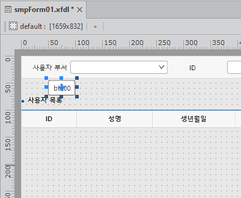

### **Button Properties 수정**

- **cssclass** : `btn_WF_searchFold`
- **id** : `btnShowHide` _id를 임의로 변경 하지 말 것_
- **text** : `공백`
- **left** : `48.76`%
- **top** : `-1` ~ `divSearch`
- **width** : `40`
- **height** : `16`

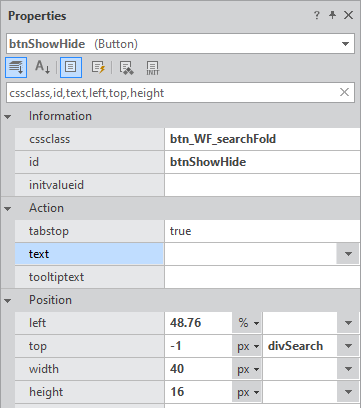

### **메인 영역 `divDetail` Properties 수정**

- **top** : `-1` ~ `btnShowHide`

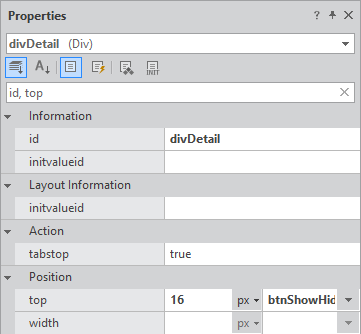

### **적용 결과**

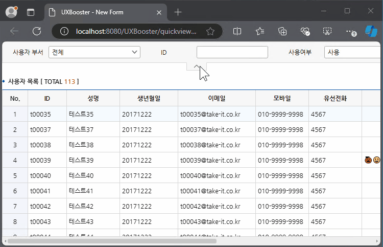