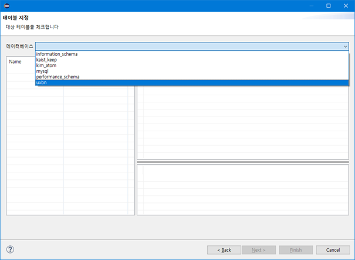
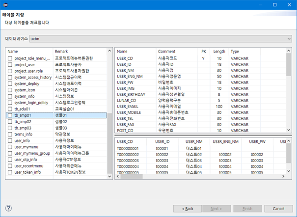
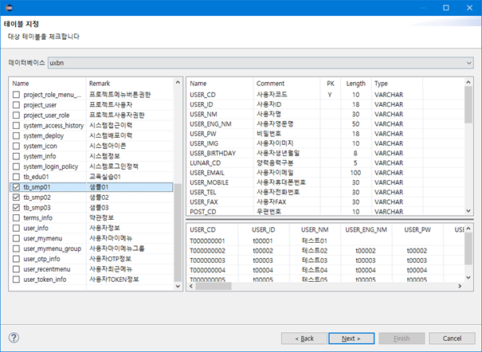
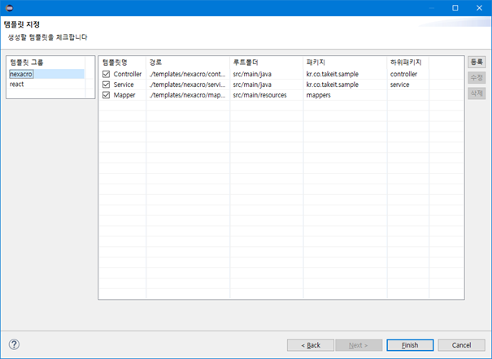
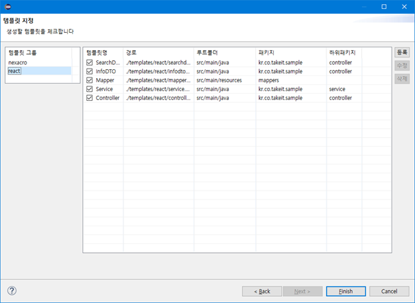
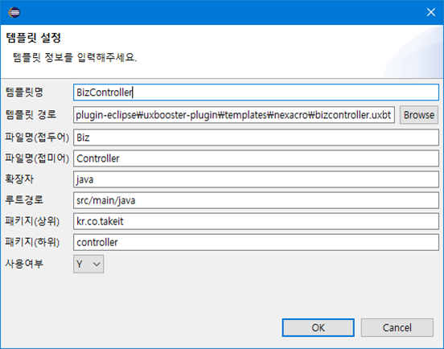
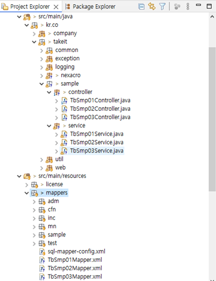

authors: glorial
summary: UXBooster Plugin Generator
id: nexacro-99-plugin-generator
categories: uxbooster-nexacro
tags: nexacro, uxbooster-nexacro
status: Published
feedback link: https://github.com/takeitcorp/takeitcorp.github.io/issues

# UXBooster Plugin 소스생성

## Generator
Duration: 0:01:00

`UXBooster - Generator` 를 선택합니다.

## 데이터소스 관리
Duration: 0:02:00

`Generator`를 실행하면 제일먼저 **데이터소스 관리** 화면이 나옵니다.

생성할 소스의 대상이 될 Table이 저장된 DB의 접속정보를 관리 할 수 있습니다.

* **등록** : 데이터소스 등록 팝업
* **수정** : 선택한 데이터소스 수정 팝업
* **삭제** : 선택한 데이터소스를 삭제
* **연결 테스트** : 선택한 데이터소스의 연결 테스트 실행

------------------------------------------------------------------------------------------------------------

## DB 연결 정보 입력
Duration: 0:05:00

### 등록버튼 클릭

`등록` 버튼을 클릭하여 새로운 데이터소스를 등록합니다.

### DB 연결 정보 입력

DB 연결 정보를 입력합니다.

`연결 테스트` 버튼을 통해 입력된 정보를 검증할 수 있습니다.

* **ID** : 사용할 데이터소스의 명칭으로 자유롭게 입력(중복방지)
* **Vendor** : DB 종류
* **Library Path** : 드라이버 파일의 경로(사용중인 DB에 맞는 드라이버를 선택)
* **Driver** : 드라이버 파일에서 제공되는 클래스(Vendor 선택 시 자동입력)
* **Host** : DB Server IP
* **Port** : DB Server Port
* **Database** : DatabaseName 또는 SID
* **Username** : 접속계정
* **Password** : 접속암호

------------------------------------------------------------------------------------------------------------

## 데이터소스 선택
Duration: 0:01:00

사용할 데이터소스를 선택 후 `Next` 버튼을 클릭합니다.

------------------------------------------------------------------------------------------------------------

## 데이터베이스(스키마) 선택
Duration: 0:01:00

Table이 속한 데이터베이스 또는 스키마를 선택합니다.

------------------------------------------------------------------------------------------------------------

## 테이블 조회
Duration: 0:03:00

데이터베이스(스키마)를 선택하면 좌측에 테이블 목록이 표시됩니다.

테이블을 선택하면 우측상단에 컬럼정보, 우측하단에 데이터(최대 5건)이 표시됩니다.

마우스 드래그로 컬럼정보와 데이터 사이의 높이를 조절 할 수 있습니다.

------------------------------------------------------------------------------------------------------------

## 테이블 선택
Duration: 0:01:00

생성할 테이블을 선택하고 `Next` 버튼을 클릭합니다.

------------------------------------------------------------------------------------------------------------

## 템플릿 관리
Duration: 0:05:00

테이블을 선택하면 템플릿을 관리하는 화면이 표시됩니다.

* **등록** : 템플릿 등록 팝업
* **수정** : 선택한 템플릿 수정 팝업
* **삭제** : 선택한 템플릿을 삭제

### 기본 템플릿 제공

UXBooster Framework 패턴의 `Nexacro`, `React` 템플릿을 기본제공합니다.

 - **Nexacro용 템플릿**

 - **React용 템플릿**

------------------------------------------------------------------------------------------------------------

## 템플릿 등록
Duration: 0:10:00

### 등록버튼 클릭

`등록` 버튼을 클릭하여 새로운 템플릿을 등록합니다.

### 템플릿 정보 입력

템플릿 정보를 입력합니다.

* **템플릿명** : 사용할 템플릿의 명칭으로 자유롭게 입력(중복방지)
* **템플릿 경로** : `Apache FreeMarker` 문법으로 작성된 `uxbt` 확장자 파일
* **파일명(접두어)** : 생성될 파일의 접두어(접두어, 접미어 중 하나만 입력 가능)
* **파일명(접미어)** : 생성될 파일의 접미어(접두어, 접미어 중 하나만 입력 가능)
* **확장자** : 생성될 파일의 확장자
* **루트경로** : 생성될 파일의 클래스패스
* **패키지(상위)** : 생성될 파일의 상위 패키지 경로(상위, 하위 중 하나만 입력 가능)
* **패키지(하위)** : 생성될 파일의 하위 패키지 경로(상위, 하위 중 하나만 입력 가능)
* **사용여부** : 사용여부가 `Y`인 템플릿만 소스 생성 시 사용

### 템플릿 작성

**템플릿 파일 작성** 시 `UXBooster Plugin`의 변수를 활용할 수 있습니다.

기본 문법은 [`공식사이트`](https://freemarker.apache.org/index.html)를 참조해 주시기 바랍니다.

> aside negative
> 
> **템플릿 변수**
> 
> 사용된 템플릿의 정보를 바탕으로 선언된 변수
> 
> - **rootPath :** `루트경로`
>  
>     	변환예시 : src/main/java
>  
> - **rootPackage** : `패키지(상위)`
>  
>     	변환예시 : kr.co.takeit.sample
>  
> - **sourcePackage** : `패키지(하위)`
>  
>     	변환예시 : controller
>  
> - **fileName** : `파일명(접두어)` + `(Pascal)Table명` + `파일명(접미어)`
>  
>     	변환예시 : GenTbSmp01Controller
>  
> - **fileExtName** : `확장자`
>  
>     	변환예시 : java
>  
> - **fileFullName** : `${fileName}`.`{fileExtName}`
>  
>     	변환예시 : GenTbSmp01Controller.java

> aside negative
> 
> **런타임 변수**
> 
> 선택된 테이블, 템플릿 정보를 바탕으로 조합 또는 생성된 변수
> 
> - **today** : `현재날짜`
> 
>     	변환예시 : 2025.07.10
> 
> - **fullPackage** : `${rootPackage}`.`${sourcePackage}` 또는 `${rootPackage}`  
> _패키지선언부, 파일생성경로로 사용_
> 
>     	변환예시 : kr.co.takeit.sample.controller
> 
> - **originName** : `Table명`
> 
>     	변환예시 : TB_SMP01
> 
> - **domainName** : `(소문자화, 언더바제거)Table명`
> 
>     	변환예시 : tbsmp01
> 
> - **entityName** : `(Pascal)Table명`
> 
>     	변환예시 : TbSmp01
> 
> - **propertyName** : `(Camel)Table명`
> 
>     	변환예시 : tbSmp01
> 
> - **fileRemark** : `Table설명`
> 
>     	변환예시 : 샘플01
> 
> - **serialVersionUID** : `Serializable 클래스의 UID`
> 
>     	변환예시 : 6327862526388102761L
> 
> - **columnList** : `하단 컬럼 변수 참조`

> aside negative
> 
> **컬럼 변수**
> 
> - **name** : `컬럼명`
> 
>     	변환예시 : USER_CD
> 
> - **camelName** : `(Camel)컬럼명`
> 
>     	변환예시 : userCd
> 
> - **pascalName** : `(Pascal)컬럼명`
> 
>     	변환예시 : UserCd
> 
> - **comment** : `컬럼설명`
> 
>     	변환예시 : 사용자코드
> 
> - **pk** : `PK 여부`
> 
>     	변환예시 : true
> 
> - **dataType** : `SQL Data Type`
> 
>     	변환예시 : 2005
> 
> - **javaTypeName** : `(SQL Data Type과 대응 될) Java Type 클래스명`
> 
>     	변환예시 : BigDecimal
> 

<!--
- **템플릿 변수**

  |      |                      |                                                                                                                                                            |
  | ---------- | -------------------- | ---------------------------------------------------------------------------------------------------------------------------------------------------------- |
  | **템플릿** | **rootPath**         | 루트경로<ul><li>변환예 : src/main/java</li></ul>                                                                                                           |
  |            | **rootPackage**      | 패키지(상위)<ul><li>변환예 : kr.co.takeit.sample </li></ul>                                                                                                |
  |            | **sourcePackage**    | 패키지(하위)<ul><li>변환예 : controller</li></ul>                                                                                                          |
  |            | **fileName**         | 파일명(접두어) + (Pascal)Table명 + 파일명(접미어)<ul><li>변환예 : GenTbSmp01Controller</li></ul>                                                           |
  |            | **fileExtName**      | 확장자<ul><li>변환예 : java</li></ul>                                                                                                                      |
  |            | **fileFullName**     | ${fileName}.{fileExtName}<ul><li>변환예 : GenTbSmp01Controller.java</li></ul>                                                                              |
  | **런타임** | **today**            | 현재날짜<ul><li>변환예 : 2025.07.10</li></ul>                                                                                                              |
  |            | **fullPackage**      | ${rootPackage}.${sourcePackage} 또는 ${rootPackage}<ul><li>변환예 : kr.co.takeit.sample.controller</li><li>**패키지선언부, 파일생성경로로 사용**</li></ul> |
  |            | **originName**       | Table명<ul><li>변환예 : TB_SMP01</li></ul>                                                                                                                 |
  |            | **domainName**       | (소문자화, 언더바제거)Table명<ul><li>변환예 : tbsmp01</li></ul>                                                                                            |
  |            | **entityName**       | (Pascal)Table명<ul><li>변환예 : TbSmp01</li></ul>                                                                                                          |
  |            | **propertyName**     | (Camel)Table명<ul><li>변환예 : tbSmp01</li></ul>                                                                                                           |
  |            | **fileRemark**       | Table설명<ul><li>변환예 : 샘플01</li></ul>                                                                                                                 |
  |            | **serialVersionUID** | Serializable 클래스의 UID<ul><li>변환예 : 6327862526388102761L</li></ul>                                                                                   |
  |            | **columnList**       | _\* 하단 컬럼 변수 참조_                                                                                                                                    |

- **컬럼 변수**
  |      |                   |                                                                                   |
  | ---------- | ----------------- | --------------------------------------------------------------------------------- |
  | **런타임** | name              | 컬럼명<ul><li>변환예 : USER_CD</li></ul>                                          |
  |            | camelName         | (Camel)컬럼명<ul><li>변환예 : userCd</li></ul>                                    |
  |            | pascalName        | (Pascal)컬럼명<ul><li>변환예 : UserCd</li></ul>                                   |
  |            | comment           | 컬럼설명<ul><li>변환예 : 사용자코드</li></ul>                                     |
  |            | pk                | PK 여부<ul><li>변환예 : true</li></ul>                                            |
  |            | dataType          | SQL Data Type<ul><li>변환예 : 2005</li></ul>                                      |
  |            | javaTypeName | (SQL Data Type과 대응 될) Java Type 클래스명<ul><li>변환예 : BigDecimal</li></ul> |
-->

------------------------------------------------------------------------------------------------------------

## 소스 생성
Duration: 0:01:00

소스 생성에 사용할 템플릿을 선택 후 `Finish` 버튼을 클릭합니다.

다음처럼 소스 생성이 완료됩니다.

