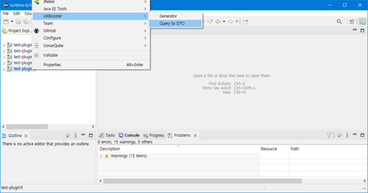
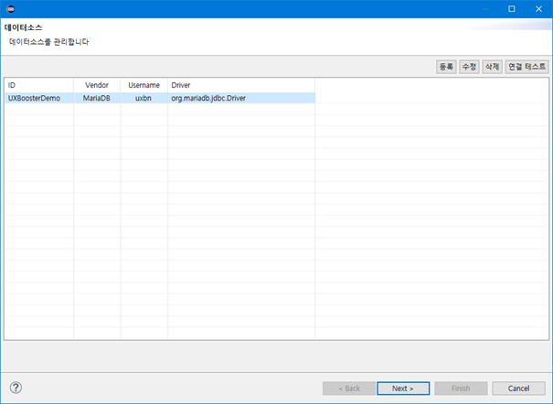
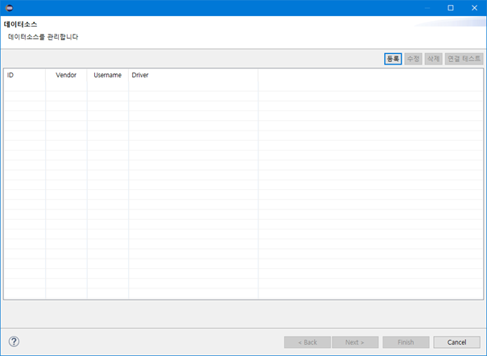
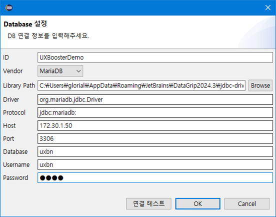
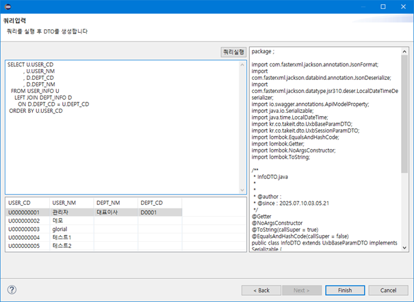

authors: glorial
summary: UXBooster Plugin Query to DTO
id: nexacro-99-plugin-querytodto
categories: uxbooster-nexacro
tags: nexacro, uxbooster-nexacro
status: Published
feedback link: https://github.com/takeitcorp/takeitcorp.github.io/issues

# UXBooster Plugin DTO 생성

## Query to DTO
Duration: 0:01:00

`UXBooster - Query to DTO` 를 선택합니다.

------------------------------------------------------------------------------------------------------------

## 데이터소스 관리
Duration: 0:02:00

`Query to DTO`를 실행하면 제일먼저 **데이터소스 관리** 화면이 나옵니다.

생성할 소스의 대상이 될 Table이 저장된 DB의 접속정보를 관리 할 수 있습니다.

* **등록** : 데이터소스 등록 팝업
* **수정** : 선택한 데이터소스 수정 팝업
* **삭제** : 선택한 데이터소스를 삭제
* **연결 테스트** : 선택한 데이터소스의 연결 테스트 실행

------------------------------------------------------------------------------------------------------------

## DB 연결 정보 입력
Duration: 0:05:00

### 등록버튼 클릭

`등록` 버튼을 클릭하여 새로운 데이터소스를 등록합니다.

### DB 연결 정보 입력

DB 연결 정보를 입력합니다.

`연결 테스트` 버튼을 통해 입력된 정보를 검증할 수 있습니다.

* **ID** : 사용할 데이터소스의 명칭으로 자유롭게 입력(중복방지)
* **Vendor** : DB 종류
* **Library Path** : 드라이버 파일의 경로(사용중인 DB에 맞는 드라이버를 선택)
* **Driver** : 드라이버 파일에서 제공되는 클래스(Vendor 선택 시 자동입력)
* **Host** : DB Server IP
* **Port** : DB Server Port
* **Database** : DatabaseName 또는 SID
* **Username** : 접속계정
* **Password** : 접속암호

------------------------------------------------------------------------------------------------------------

## 데이터소스 선택
Duration: 0:01:00

사용할 데이터소스를 선택 후 `Next` 버튼을 클릭합니다.

------------------------------------------------------------------------------------------------------------

## DTO 생성
Duration: 0:01:00

`SELECT` 쿼리를 입력 후 `쿼리실행` 버튼을 클릭합니다.

조회된 컬럼 정보를 활용하여 DTO가 생성됩니다.

