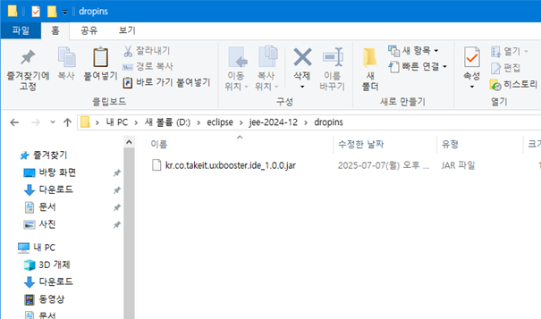
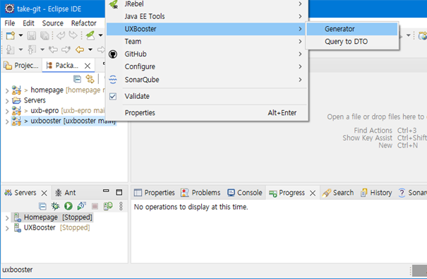
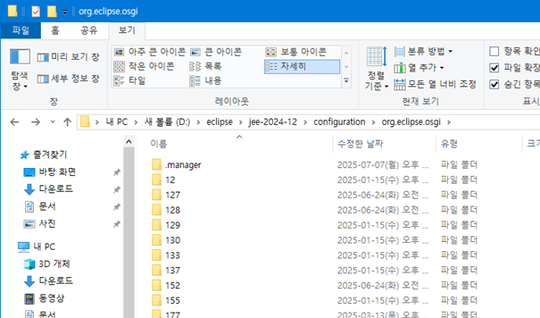
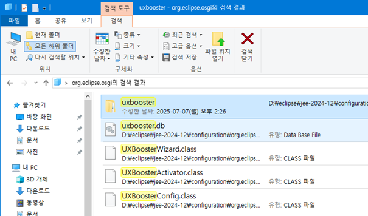
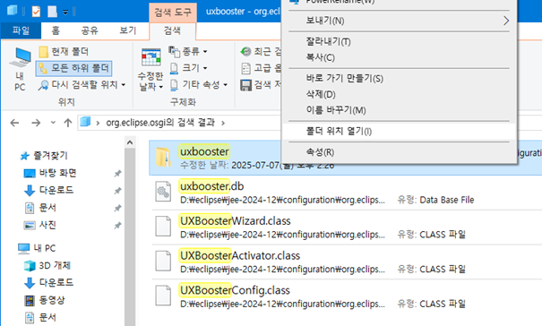
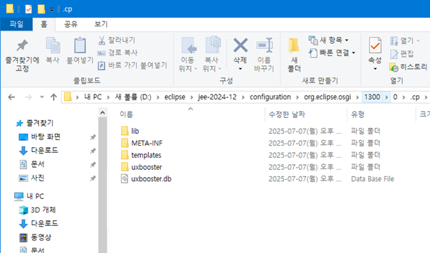
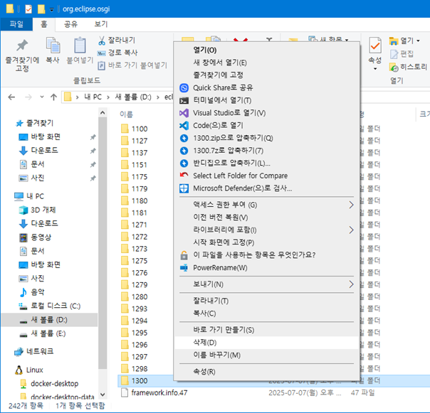
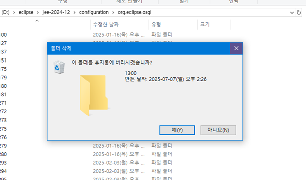
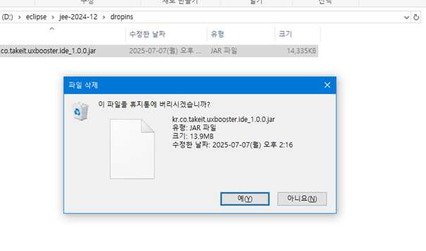

authors: glorial
summary: UXBooster Plugin
id: nexacro-99-plugin
categories: uxbooster-nexacro
tags: nexacro, uxbooster-nexacro
status: Published
feedback link: https://github.com/takeitcorp/takeitcorp.github.io/issues

# UXBooster Plugin 소개

## UXBooster Plugin
Duration: 0:01:00

### **UXBooster**는 반복작업 단축을 위한 소스 생성을 위한 **IDE Plugin**을 제공합니다.

> aside negative
>
>  **Generator**  [사용법](../nexacro-99-plugin-generator/#0)
>  
>   - Table 단위의 Controller, Service, DTO, Mapper 등의 소스를 생성합니다.
>
>  **Query To DTO**  [사용법](../nexacro-99-plugin-generator/#0)
>  
>   - 사용자가 입력한 쿼리 결과를 바탕으로 DTO 소스를 생성합니다.

#### 지원 IDE

* **Eclipse/STS** : 2020-06 (4.16.0) 이상, JDK 1.8 이상
* **IntelliJ** : IntelliJ 2023.1.5 이상, JDK 17 이상

#### 지원 DBMS
* **Oracle**, **SQLServer**, **MySQL**, **MariaDB**, **PostgreSQL**, **Tibero**

------------------------------------------------------------------------------------------------------------

## 설치
Duration: 0:01:00

제공받은 `jar`파일을 `ECLIPSE_HOME/dropins` 폴더로 붙여넣습니다.

------------------------------------------------------------------------------------------------------------

## 설치확인

`Eclipse`를 시작하여 프로젝트를 선택한 후 **마우스 오른쪽 버튼**을 클릭하면,

**UXBooster** 전용 메뉴가 컨텍스트 메뉴에 추가되어 있는 것을 확인할 수 있습니다.

해당 메뉴를 통해 기능들을 손쉽게 실행할 수 있습니다.

------------------------------------------------------------------------------------------------------------

## 제거
Duration: 0:03:00

`Eclipse` 종료 후 `ECLIPSE_HOME/configuration/org.eclipse.osgi` 폴더로 이동합니다.

`uxbooster` 로 검색을 합니다.

검색된 `uxbooster` 폴더로 이동합니다.

`ECLIPSE_HOME/configuration/org.eclipse.osgi` 하위 경로를 확인합니다.

예제에서는 `1300`으로 확인됩니다.

다시 `ECLIPSE_HOME/configuration/org.eclipse.osgi` 로 이동하여 해당폴더를 삭제합니다.

예제에서는 `1300`으로 확인됩니다.

`ECLIPSE_HOME/dropins` 폴더로 이동합니다.

제공받은 `jar`파일을 삭제합니다.

