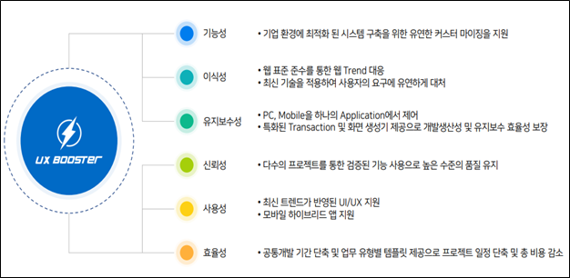
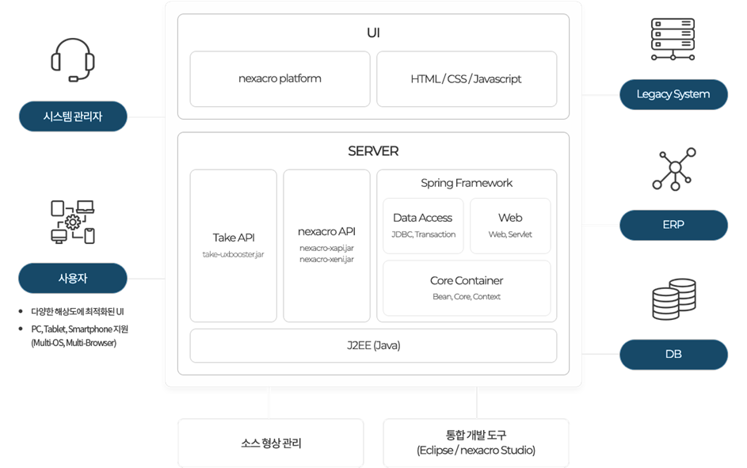
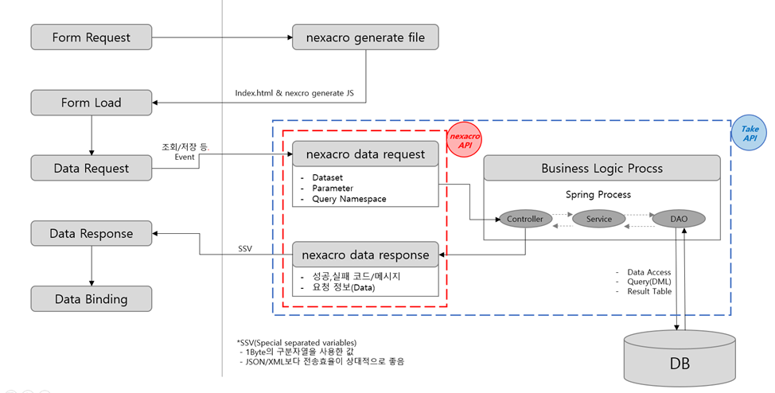

authors: glorial
summary: 1. UXBooster 소개
id: nexacro-01-intro
categories: uxbooster-nexacro
tags: nexacro, uxbooster-nexacro
status: Published
feedback link: https://github.com/takeitcorp/takeitcorp.github.io/issues

# 1. UXBooster 소개

## UXBooster
Duration: 0:02:00

UXBooster는 Spring Framework와 UI 플랫폼인 Nexacro를 보다 쉽게 통합하고 개발할 수 있도록 설계된 프레임워크입니다. 
이를 통해 개발자들은 복잡한 코딩 과정 없이 효율적으로 애플리케이션을 구축할 수 있으며, 
기업은 개발 속도를 높이고 비용을 절감할 수 있습니다.

**개발환경 구성**
* OS : Windows _(Nexacro Studio는 Windows계열에서만 사용 가능합니다)_
* JDK : OpenJDK 1.8
* Spring Framework : 4.3.28
* Nexacro SDK : 24.0.0.200
* Tomcat : 9.0
* DB : Oracle, MSSQL, MySQL, PostgreSQL, Tibero, Sybase, DB2
* IDE : Eclipse 2022-12(4.26.0), eGovFrameDev-4.2.0, Nexacro Studio(Latest)

------------------------------------------------------------------------------------------------------------

## Framework 구성
Duration: 0:02:00

### UI
* Nexacro Platform : 투비소프트에서 제공하는 웹 UI Platform  

### Server
* J2EE (Java) 객체지향언어인 Java 기반 ( _JDK1.8이상_ )  
* Spring Framework  
    * Core Container : Bean Factory, JNDI등 기본적인 Spring Core  
    * Data Access : Data Access 및 Transaction 처리  
    * Web : Web-Servlet 모듈로 MVC패턴 지원  
* Take API : 테이크에서 제공하는 라이브러리  
* Nexacro API : 투비소프트에서 제공하는 Nexacro 연계를 위한 API  

------------------------------------------------------------------------------------------------------------

## 프로세스
Duration: 0:02:00

### **1. Client 화면 요청**
* 사용자는 웹브라우저를 통한 화면을 요청
### **2. Client Data 요청**
* 응답으로 수신된 화면에서 데이터를 요청
### **3. Server 처리 후 Data 응답**
* Server에서 Business Logic 결과를 전송  
* Data 요청 / 응답 시 `SSV` Contenty-Type을 사용

------------------------------------------------------------------------------------------------------------

## 기본제공 기능
Duration: 0:01:00

### **Framework**
  - 세션 처리 (+ 중복 로그인 제어)
  - Multi DataSource 지원, DB Transaction 처리
  - Service Interface 불필요, 공용 DAO 제공, Exception 처리
  - Xss 공격 방지, 로깅 처리
  - 페이징 처리, 유틸 클래스 제공

### **관리자 기능**
  - 시스템 접근 이력 / 제어

### **가이드**
  - 다양한 샘플 제공
  - 커스터마이징 문서 제공

------------------------------------------------------------------------------------------------------------

