authors: glorial
summary: 2. UXBooster 개발도구 설치
id: nexacro-02-install
categories: uxbooster-nexacro
tags: nexacro, uxbooster-nexacro
status: Published
feedback link: https://github.com/takeitcorp/takeitcorp.github.io/issues

# 2. UXBooster 개발도구 설치

-------------------------------------------------------------------------------------------------------------

## UXBooster 개발도구 설치
Duration: 0:05:00

### **UXBooster.exe 실행**
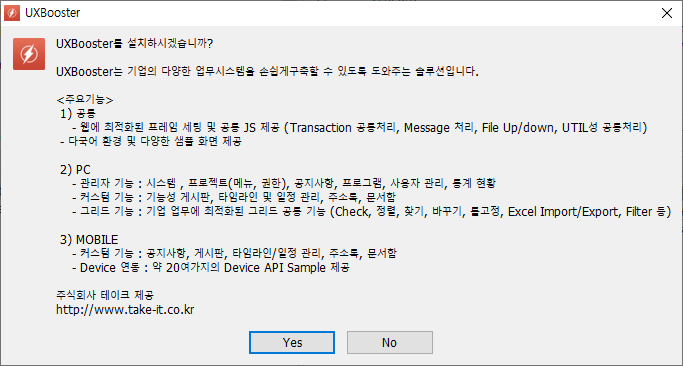

### **C:\UXBooster에 설치합니다**
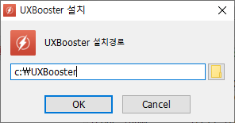

### **설치가 완료 되면 바탕화면에 바로가기가 생성됩니다**
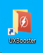

-------------------------------------------------------------------------------------------------------------

## Eclipse
Duration: 0:01:00

### **C:\UXBooster\eclipse\eclipse.exe 를 더블클릭**
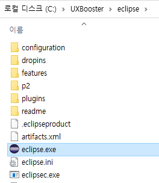  

### **C:\UXBooster\workspace 선택**
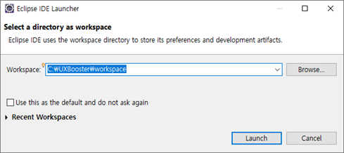  

-------------------------------------------------------------------------------------------------------------

## (선택)SVN
Duration: 0:05:00

> aside negative
>
> (선택) SVN으로 소스를 가져올 경우

### **Windows - Show View - Other 선택**
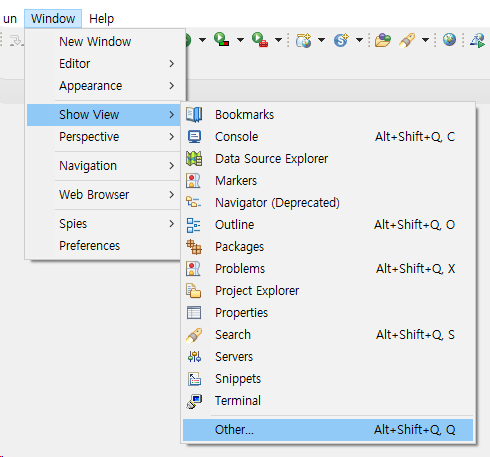

### **SVN - SVN Repositores 선택**
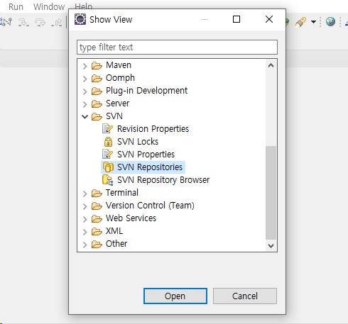

### **New - Repository location**
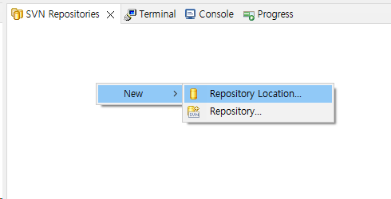

### **SVN 접속 정보 입력**
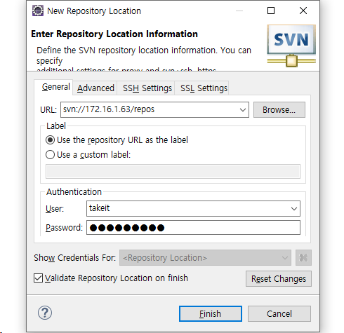

**접속정보**
* URL : 지정된 SVN URL정보(회사별 별도 지정)
* User : 지정된 SVN ID값 (개발자별 별도 지정)
* Password : 지정된 SVN 패스워드 값 (개발자별 별도 지정

### Check Out
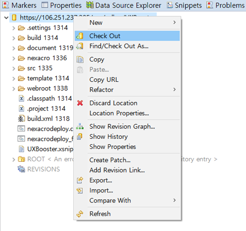

-------------------------------------------------------------------------------------------------------------

## Maven
Duration: 0:01:00

### **프로젝트 우클릭 - Maven - Update Project**
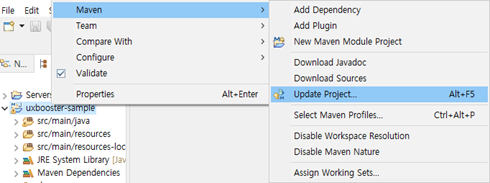  

### **Update Maven Project 실행**
Force Update of Snapshots/Releases 체크

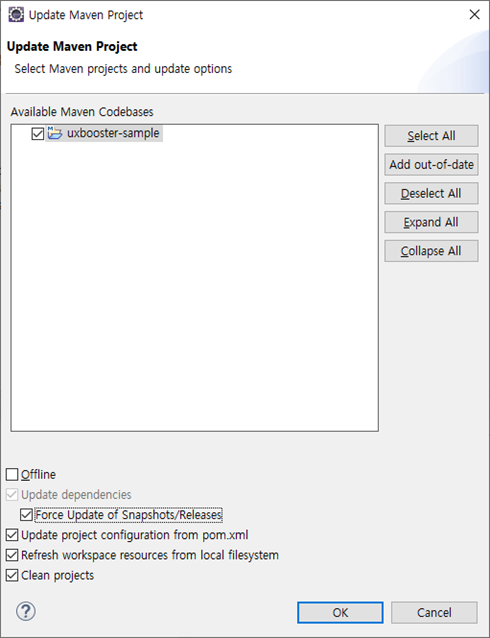

> aside negative
>
> Maven 오류 발생 시  
> 1. `Eclipse` 종료  
> 2. `%UserProfile%\.m2\repository` 하위폴더 삭제  
> 3. `Eclipse` 시작 후 `Update Project` 실행  

-------------------------------------------------------------------------------------------------------------

## (선택)Tomcat 추가
Duration: 0:05:00

> aside negative
>
> (선택) SVN으로 소스를 가져온 경우

### **'No servers are…'를 클릭**
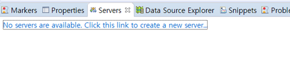

### **Apache - Tomcat v9.0 Server를 선택**
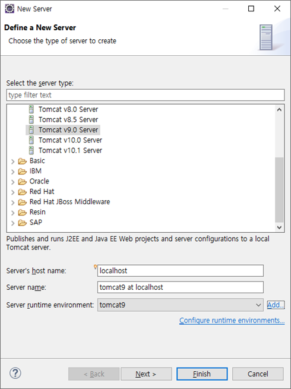

### **Tomcat 설치경로 선택**
`Tomcat Installation directory`를 `C:\UXBooster\tools\apache-tomcat-9.0.65`로 지정 후 Next

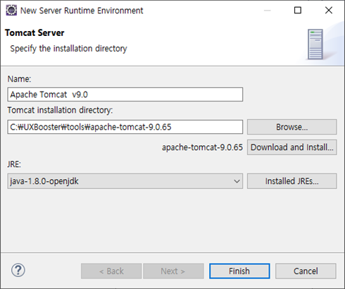  

### **Application 추가**
Available에 있는 `uxbooster-sample`을 선택 후 Add - Finish

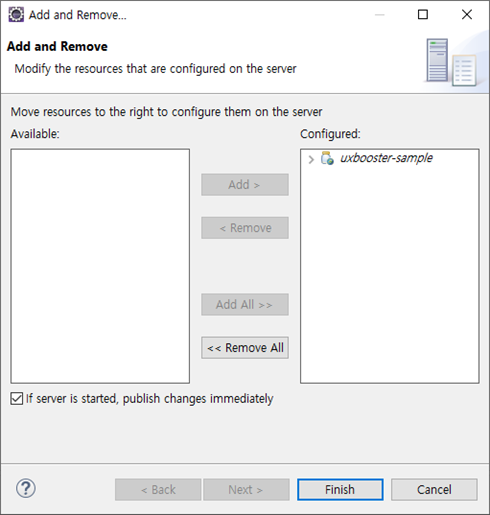  

### **Tomcat 설정**
Tomcat Server를 더블클릭

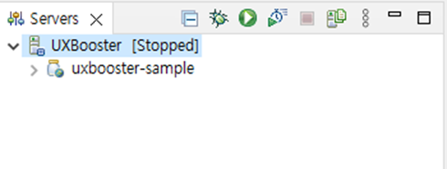

### **Server Option 설정**
`Serve modules without publishing` 체크 후 저장

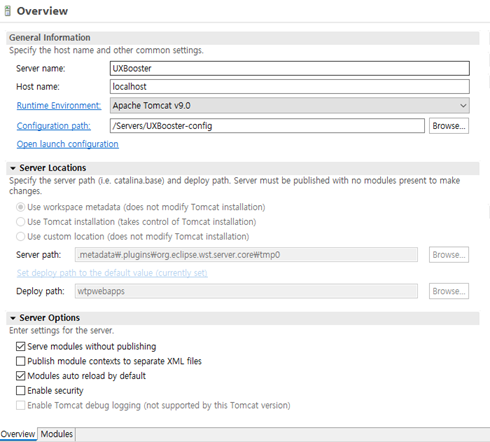

-------------------------------------------------------------------------------------------------------------

## Tomcat 실행
Duration: 0:01:00

### **Servers - Tomcat - Start**
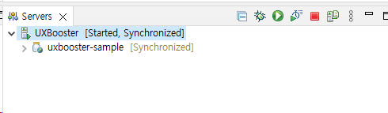

### **Windows - Show View - Console 출력 결과**
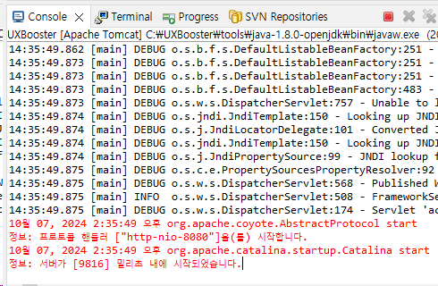

### **브라우저 실행 결과**
[http://localhost:8080/UXBooster](http://localhost:8080/UXBooster)

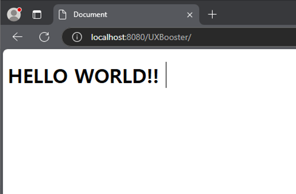  

-------------------------------------------------------------------------------------------------------------

## Nexacro Studio 설치
Duration: 0:02:00

### **C:\UXBooster\tools\NexacroN_SetupStudio.exe 실행**
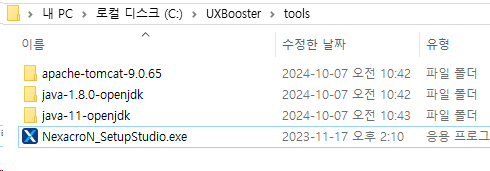

-------------------------------------------------------------------------------------------------------------

## **Nexacro Project**
Duration: 0:01:00

### **Open - Project**
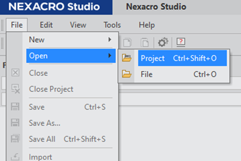

### **Project 선택**
`C:\UXBooster\workspace\uxbooster-sample\nexacro\UXBoosterN.xprj`

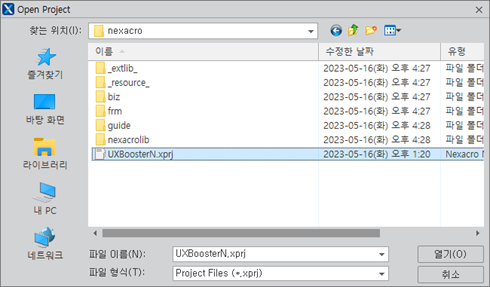

-------------------------------------------------------------------------------------------------------------

## **Code Snippet 추가**
Duration: 0:02:00

### **Assist - Code Snippet 클릭**
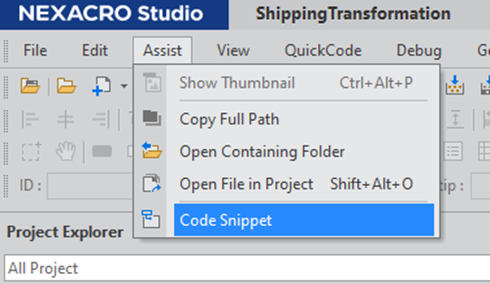

### **Options 클릭**
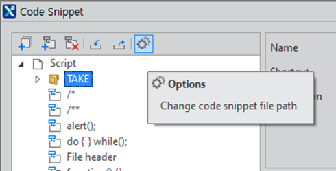

### **UXBooster.xsnippet 선택**
`C:\UXBooster\workspace\uxbooster-sample\nexacro\UXBooster.xsnippet`

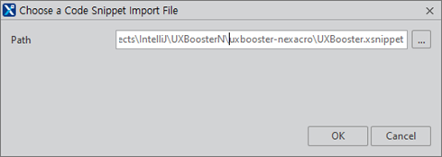

### **추가된 take 함수 확인**
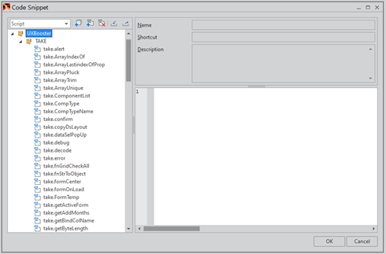

-------------------------------------------------------------------------------------------------------------

## SDK, Generate 경로 지정
Duration: 0:02:00

### **Tools - Options 클릭**
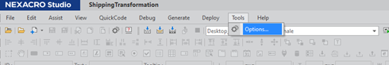

### **Project - General - Base Library Path 경로 지정**
`C:\UXBooster\workspace\uxbooster-sample\nexacro\nexacrolib`

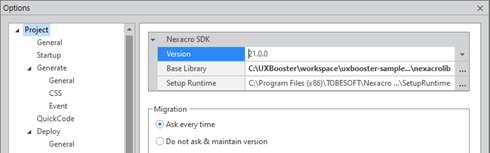  

### **Project - Generate 경로 지정**
`C:\UXBooster\workspace\uxbooster-sample\src\main\webapp`

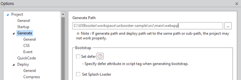  

### **Generate - Regenerate - Application 실행**
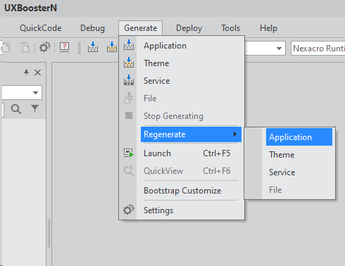

> aside positive
>
> Generate : 기존에 빌드 된 파일은 제외  
> Regenerate : 모든 파일을 다시 빌드  
> [관련문서](https://docs.tobesoft.com/development_tools_guide_nexacro_n_v24_ko/0067966aeb0e944f#1dde595d080ae247)  

-------------------------------------------------------------------------------------------------------------

## UXBooster 실행
Duration: 0:03:00

### **Eclipse Tomcat 실행**
Servers - Tomcat - Start

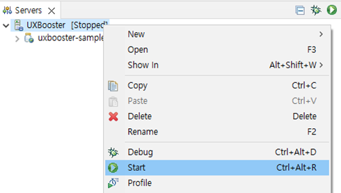

### **(선택) Nexacro Studio Browser 선택**
Chrome, Edge 중 선택

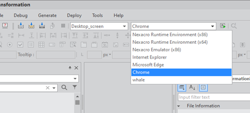

### **(선택) Generate - Launch - Web Server 실행**
`Web Server` : http://localhost:8080/UXBooster/

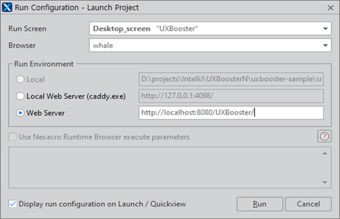

### **브라우저 실행결과**
[http://localhost:8080/UXBooster/](http://localhost:8080/UXBooster/)

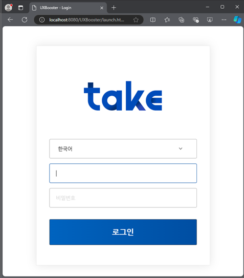